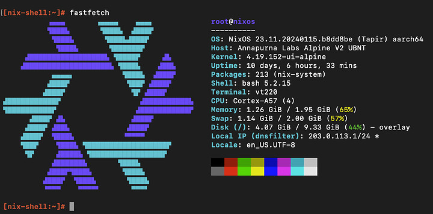
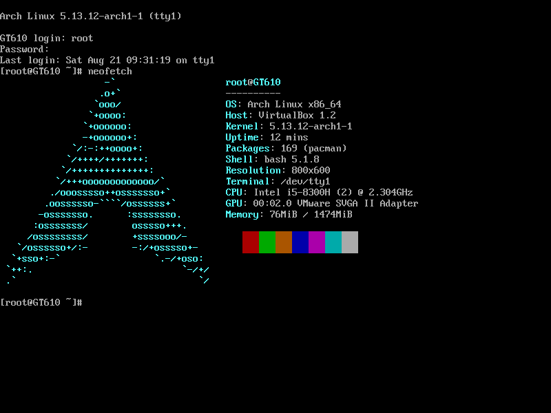

<h1 align="center">🐧 Setup-OS</h1>

<p align="center">
  <strong>Configurations Linux centralisées : Arch, NixOS et Rocky Linux</strong>
</p>

<p align="center">
  
  
  
  
  
</p>

---

## Structure

```
setup-os/
├── nixos/
├── arch-linux/
└── rocky-linux/
```

---

## Distributions

###  NixOS

Configuration déclarative avec Flakes, Hyprland et modules système.

[**nixos-iso**](https://releases.nixos.org/nixos/24.05/nixos-gnome-24.05.5695.59fb44bbd20-x86_64-linux.iso) · [Documentation](nixos/README.md)

```bash
sudo cp -r /etc/nixos /etc/nixos-backup-$(date +%Y%m%d)
sudo git clone https://github.com/RomeoCavazza/setup-os.git /etc/nixos
cd /etc/nixos/nixos
sudo nixos-rebuild switch
```

**Modules disponibles** :

| Module | Services | Ports |
|--------|----------|-------|
| `databases.nix` | PostgreSQL 17 + Redis | 5432, 6379 |
| `lamp.nix` | Apache + PHP + MariaDB | 80, 3306 |
| `launcher.nix` | Rofi + Nemo + Waybar | — |
| `nginx.nix` | Reverse proxy | 8081, 8082, 8083 |
| `nvidia-prime.nix` | NVIDIA PRIME (optionnel) | — |
| `observability.nix` | Loki + Prometheus + Grafana | 3000, 9090, 3100 |
| `ollama.nix` | IA locale | 11434 |
| `streamlit.nix` | Apps Streamlit | 8501 |
| `tmpfiles.nix` | Règles tmpfiles systemd | — |

```nix
imports = [
  ./modules/databases.nix
  ./modules/observability.nix
  ./modules/ollama.nix
];
```

<p align="center">
  
</p>

---

###  Arch Linux

Dotfiles avec Hyprland, Waybar, Tabby, VSCodium et Ollama.

[**arch-iso**](https://archlinux.org/download/) · [Documentation](arch-linux/README.md)

```bash
cd arch-linux
chmod +x scripts/install.sh
./scripts/install.sh
```

<p align="center">
  
</p>

---

###  Rocky Linux

Distribution entreprise RHEL-compatible.

[**rocky-iso**](https://rockylinux.org/download) · [Documentation](rocky-linux/README.md)

```bash
sudo dd if=rocky-linux/rocky-10-gnome.iso of=/dev/sdb bs=4M status=progress
```

<p align="center">
  
</p>

---

## Sécurité

**Exclus** (`.gitignore`) : `hardware-configuration.nix`, `flake.lock`, secrets

---

<p align="center">
  Made by <a href="https://github.com/RomeoCavazza">Romeo Cavazza</a>
</p>
