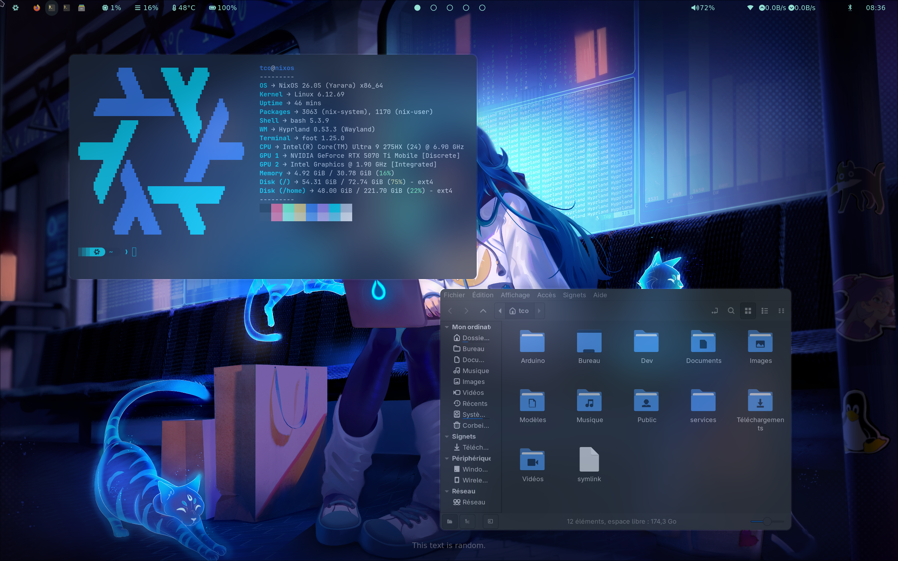
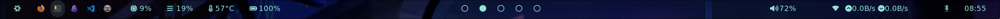
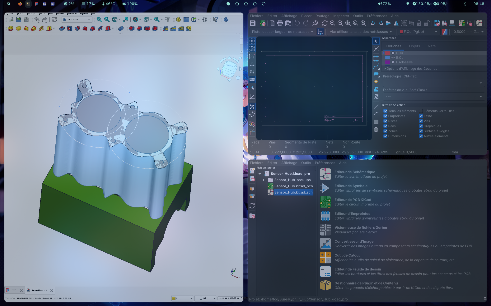
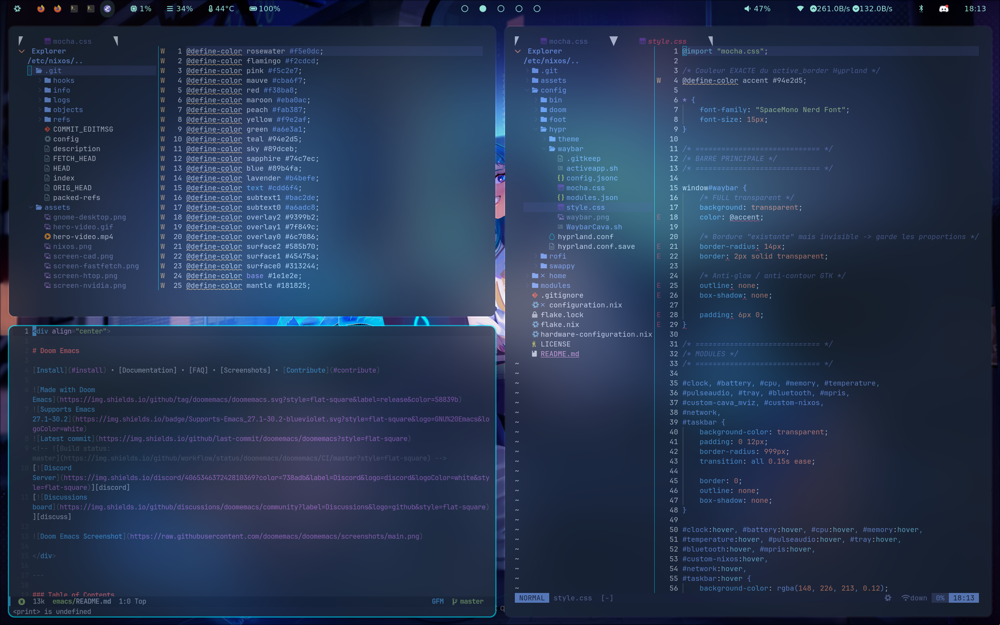
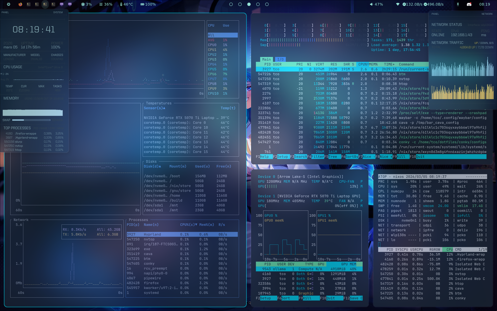
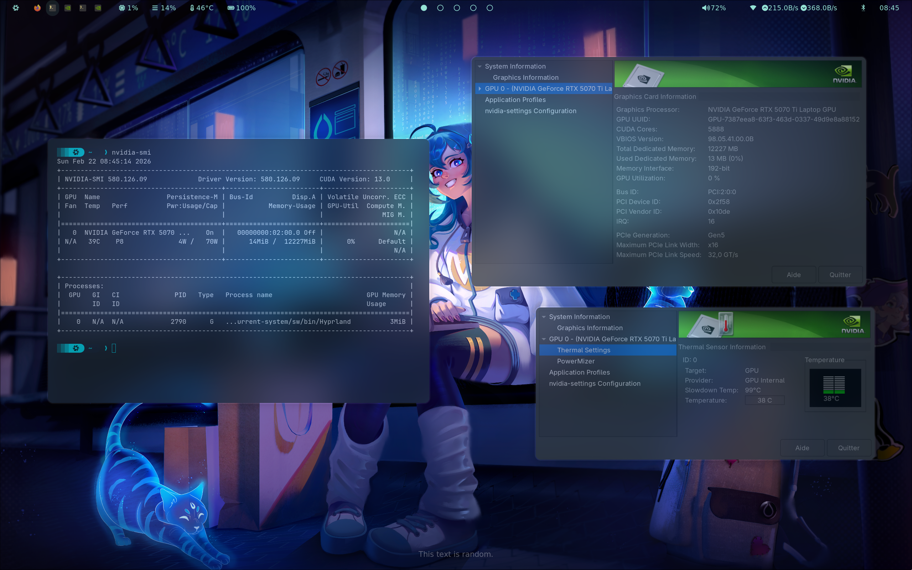

<div align="center">
  
  <h1>【 NixOS dotfiles 】</h1>
  <p><strong>Declarative, modular, and optimized workstation configuration</strong></p>

  <div align="center">
    
    
    
  </div>

  <div align="center">
    
    
    
    
  </div>
</div>

---

## • Overview •

> [!IMPORTANT]
> **Warning**: This configuration is tailored for my hardware. Don't blindly use these settings unless you know what they entail. Use at your own risk!

> [!NOTE]
> This repository uses a modular structure, allowing you to easily toggle specific services (databases, AI, monitoring) by importing the corresponding files in `configuration.nix`.

### Notable Features
- **Window Management**: [Hyprland](https://hyprland.org/) with Dwindle layout and Catppuccin Mocha theme.
- **Hardware Optimization**: NVIDIA PRIME support, Pipewire audio, and custom bootloader entries.
- **Development Ready**: Built-in modules for PostgreSQL, Redis, Ollama (Local AI), and Data Science.
- **Observability**: Ready-to-use Grafana, Prometheus, and Loki stack.

---

## • Screenshots •

<div align="center">
  
</div>

<br>

<div align="center">
  
  <p><em>Desktop Interface - <a href="./config/hypr/waybar">Waybar Configuration</a></em></p>
</div>

<br>

| Hardware Detail | Development Setup |
|:---:|:---:|
|  |  |
| **System Monitoring** | **NVIDIA Graphics** |
|  |  |

---

## • Contents •

- **NixOS Config**: Main system configuration and Flake setup.
- **Modules**: Pluggable components for databases, servers, and tools.
- **Hyprland**: Highly customized Wayland compositor configuration.
- **Home Manager**: User-specific environment management.

---

## • Installation •

### Prerequisites
- [NixOS ISO](https://channels.nixos.org/nixos-unstable/latest-nixos-graphical-x86_64-linux.iso)
- Basic knowledge of Nix flakes.

### Setup Instructions

> [!TIP]
> You can test individual development environments without installing them globally by using `nix develop .#ai` or `nix develop .#embedded`.

1. **Backup your current config**:
   ```bash
   sudo cp -r /etc/nixos /etc/nixos-backup
   ```

2. **Clone this repository**:
   ```bash
   sudo git clone https://github.com/RomeoCavazza/setup-os.git /etc/nixos-new
   sudo cp -r /etc/nixos-new/* /etc/nixos/
   ```

3. **Apply the configuration**:
   ```bash
   cd /etc/nixos
   sudo nixos-rebuild switch --flake .#nixos
   ```

---

## • Software Overview •

| Component | Purpose | Details |
| :--- | :--- | :--- |
| **Hyprland** | Compositor | Catppuccin Mocha, Waybar, Rofi |
| **PostgreSQL** | Database | Version 17 with PostGIS |
| **Ollama** | Local AI | Hosted on port 11434 |
| **Nginx** | Reverse Proxy | Configured for ports 8081-8083 |
| **Grafana** | Monitoring | Dashboard on port 3000 |
