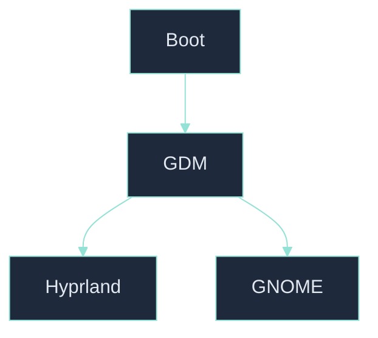

<div align="center">
  
  <h1>NixOS dotfiles</h1>
  <p><strong>Declarative, modular, and optimized workstation configuration</strong></p>

  <div align="center">
    
    
    
    
    
    
    
  </div>
</div>

---

## Overview

> [!IMPORTANT]
> **Warning**: This configuration is tailored for my hardware. Don't blindly use these settings unless you know what they entail. Use at your own risk!

> [!NOTE]
> This repository uses a modular structure, allowing you to easily toggle specific services (databases, AI, monitoring) by importing the corresponding files in `configuration.nix`.

```
nixos/
├── config/
│   ├── bin/          # Custom scripts
│   ├── doom/         # Doom Emacs
│   ├── foot/         # Terminal
│   ├── hypr/         # Hyprland + Waybar
│   ├── rofi/         # Active Rofi runtime
│   └── swappy/       # Screenshot editor config
├── home/tco/
│   ├── home.nix      # Home Manager entry point
│   ├── modules/
│       └── apps/
│           ├── cad.nix       # obsidian, kicad, freecad
│           ├── embedded.nix  # arduino, esptool, minicom
│           └── data.nix      # dbeaver, grafana, influxdb2
├── modules/          # System-only modules (services, drivers)
│   ├── backup.nix
│   ├── nvidia-prime.nix
│   ├── virtualisation.nix
│   ├── databases.nix
│   ├── ollama.nix
│   ├── observability.nix
│   └── ...
├── secrets/          # SOPS-encrypted secrets committed safely
├── configuration.nix
├── flake.nix
└── flake.lock
```

---

## Preview

<div align="center">
  
</div>

<br>


*Desktop Interface — [Waybar Configuration](./config/hypr/waybar) · [Wallpaper](./docs/assets/background.png)*

<br>

> [!TIP]
> This setup ships with **two desktop environments** accessible via GDM — switch seamlessly between **Hyprland** and **GNOME** at login.

#### Session at login


```mermaid
%%{init: {'theme': 'base', 'themeVariables': { 'primaryColor': '#1e293b', 'secondaryColor': '#0f172a', 'tertiaryColor': '#0f172a', 'primaryBorderColor': '#94e2d5', 'lineColor': '#94e2d5', 'primaryTextColor': '#e2e8f0', 'clusterBkg': '#0f172a', 'clusterBorder': '#475569' }}}%%
flowchart TB
  Boot["Boot"]
  GDM["GDM"]
  H["Hyprland"]
  G["GNOME"]

  Boot --> GDM
  GDM --> H
  GDM --> G
```

### GNOME


<br>

### Hyprland


<br>

### Code Environment


*Fully featured Neovim setup for efficient coding and development.*

<br>

### Virtualization


*Seamless virtualization support for running isolated environments and testing.*

<br>

### Hardware & Modeling


*Optimized performance for demanding CAD and 3D modeling workloads.*

<br>

### System Metrics


*Real-time system monitoring and resource management.*

<br>

### Graphics Engine


*Dedicated NVIDIA GPU integration with Prime support for maximum graphics power.*

---

## Live Infrastructure


The observability stack (Prometheus + Loki + Grafana + Promtail) publishes live
dashboard snapshots generated locally by a systemd timer.

The dashboard set is now intentionally split by purpose:

- NixOS Metrics: cockpit now view (pressure and rebuild cost)
- Nix Efficiency: drift view (freshness, generation debt, closure structure)
- Incident Correlation: pressure spikes mapped to Loki logs

Snapshot generation is documentation-only (15 minute timer + 0.5% visual delta gate). Live
operations always happen in Grafana directly.

Annexes and technical references live in `docs/`:

- [**docs/README.md**](./docs/README.md) — annexes, Mermaid diagrams, and regeneration commands
- [**docs/cloc-report.md**](./docs/cloc-report.md) — raw cloc report
- [**docs/specification.txt**](./docs/specification.txt) — dense configuration glossary
- [**docs/diagrams/**](./docs/diagrams/) — puml sources (`.puml`) and generated PNGs in `docs/assets/diagrams/`

---

## Documentation

The [**GitHub Wiki**](https://github.com/RomeoCavazza/setup-os/wiki) is the primary documentation resource for this repository. It covers the architecture and flake design, the SOPS/Age secrets model, and a detailed breakdown of every system and user module with the reasoning behind each configuration decision.

- [Architecture & Flake Logic](https://github.com/RomeoCavazza/setup-os/wiki/Architecture-&-Flake-Logic)
- [Modules Breakdown](https://github.com/RomeoCavazza/setup-os/wiki/Modules-Breakdown)
- [Security & Secrets](https://github.com/RomeoCavazza/setup-os/wiki/Security-&-Secrets)
- [Observability and Metrics](https://github.com/RomeoCavazza/setup-os/wiki/Observability-and-Metrics)

---

## Backup & Secrets

This setup now ships with encrypted cloud backups built around:

- `sops-nix` for encrypted, committable secrets
- `restic` for deduplicated snapshots
- Backblaze B2 as the remote object storage backend

The active design is split in two backup jobs:

- `b2-critical` — `/etc/nixos`, `~/.ssh`, `~/.gnupg`, `~/.config`
- `b2-data` — `~/Desktop`, `~/Documents`, `~/Images`

Secrets are stored in-repo in encrypted form under [`secrets/`](./secrets/), while the local Age private key stays outside the repository.

---

## Installation

### Prerequisites
- [NixOS ISO](https://channels.nixos.org/nixos-unstable/latest-nixos-graphical-x86_64-linux.iso)
- [Ventoy](https://www.ventoy.net/en/download.html) or [Rufus](https://rufus.ie/en/) to create a bootable USB drive.

### Setup Instructions

> [!TIP]
> Development toolchains (Rust, Python, embedded, data) are installed globally via Home Manager. Per-project environments use a local `flake.nix` with `direnv` — `cd` into the project directory and the environment loads automatically.

1. **Backup your current config**:
   ```bash
   sudo cp -r /etc/nixos /etc/nixos-backup
   ```

2. **Clone this repository**:
   ```bash
   sudo git clone https://github.com/RomeoCavazza/setup-os.git /etc/nixos-new
   sudo cp -r /etc/nixos-new/* /etc/nixos/
   ```

3. **Apply the configuration**:
   ```bash
   cd /etc/nixos
   sudo nixos-rebuild switch --flake .#nixos
   ```
