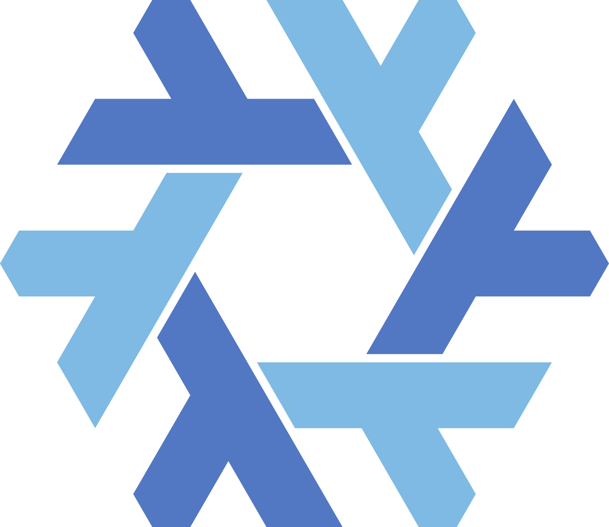
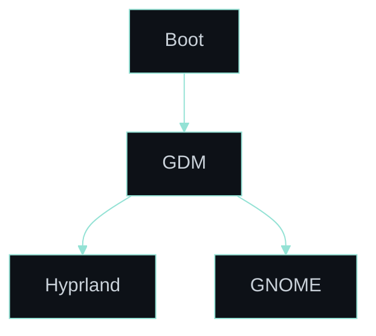
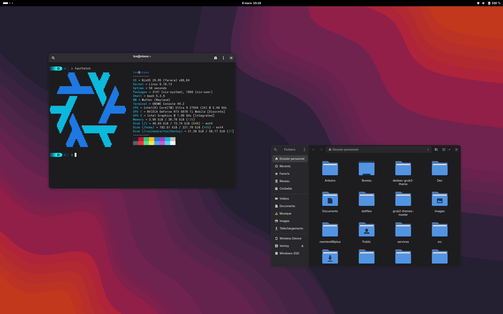
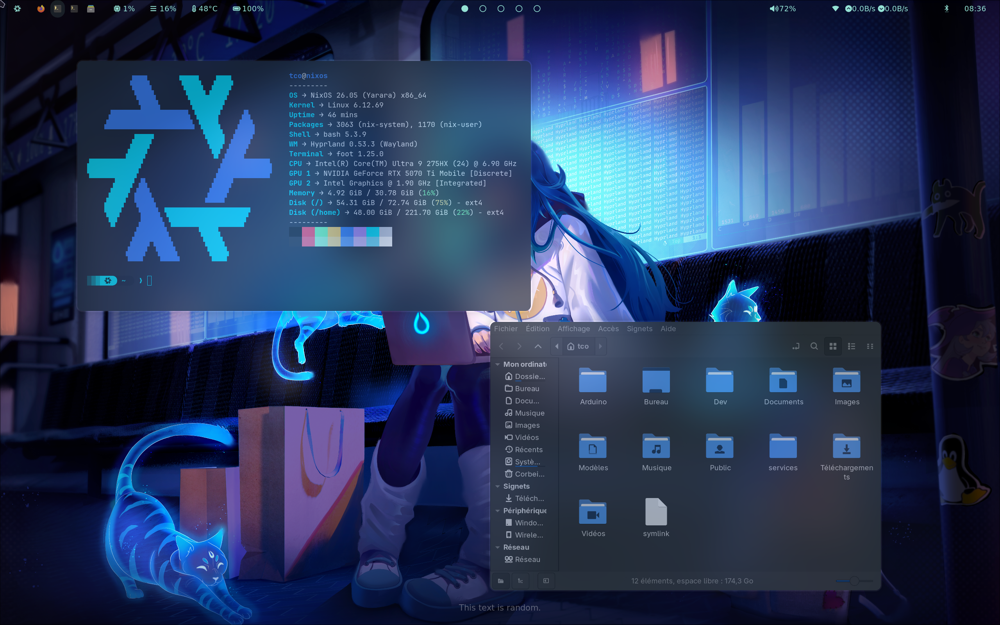
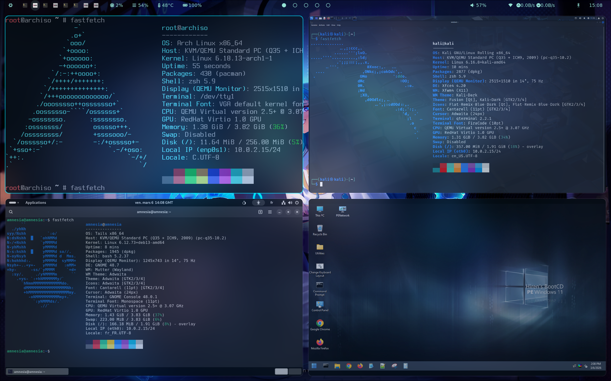
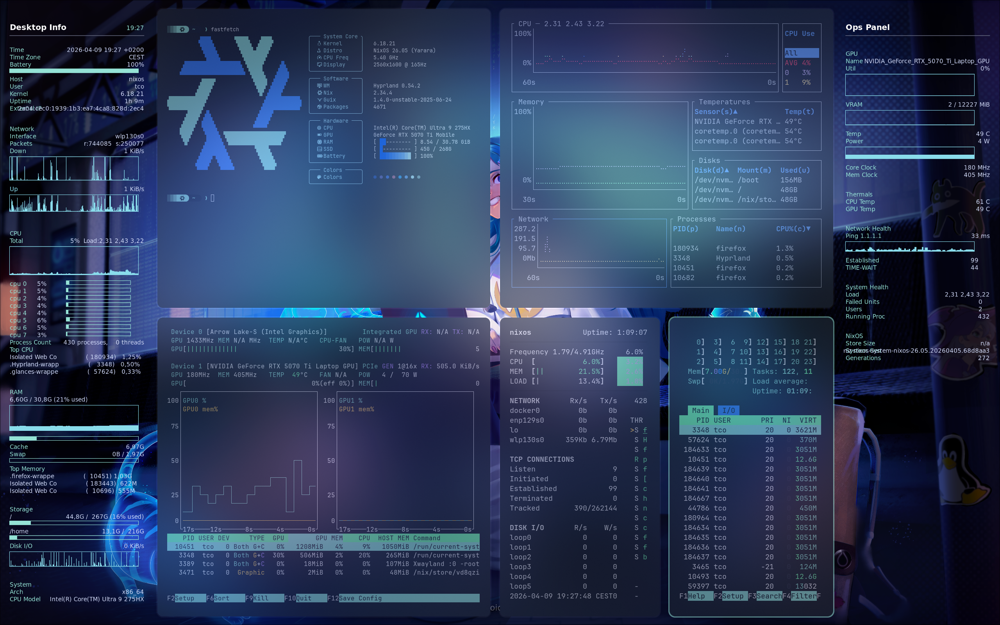
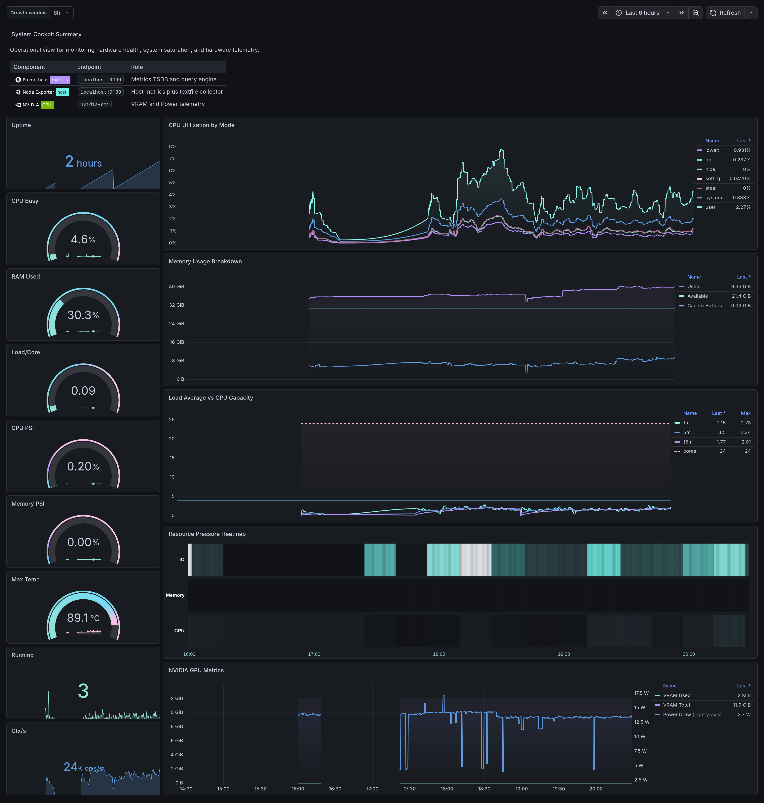

<div align="center">
  
  <h1>NixOS dotfiles</h1>

  <div align="center">
    
    
    
    
    
    
    
    
    
  </div>
</div>

---

## Overview

The [**GitHub Wiki**](https://github.com/RomeoCavazza/setup-os/wiki) is the primary documentation resource for this repository.

- [Architecture & Flake Logic](https://github.com/RomeoCavazza/setup-os/wiki/Architecture-&-Flake-Logic)
- [Modules Breakdown](https://github.com/RomeoCavazza/setup-os/wiki/Modules-Breakdown)
- [Security & Secrets](https://github.com/RomeoCavazza/setup-os/wiki/Security-&-Secrets)
- [Observability and Metrics](https://github.com/RomeoCavazza/setup-os/wiki/Observability-and-Metrics)

Local technical annexes:

- [docs/README.md](./docs/README.md) - annexes, Mermaid diagrams, and regeneration commands
- [docs/cloc-report.md](./docs/cloc-report.md) - raw cloc report
- [docs/specification.txt](./docs/specification.txt) - dense configuration glossary
- [docs/diagrams/](./docs/diagrams/) - PlantUML sources and generated PNGs
- [See all diagram references (Architecture Index)_](https://github.com/RomeoCavazza/setup-os/tree/main/docs/diagrams)

### Architecture

```
nixos/
├── config/           # Application-specific configurations (Hypr, scripts, terminal)
├── home/tco/         # Home Manager entry point and user-space modules
│   └── modules/      # Domain-specific apps (CAD, data, embedded)
├── modules/          # System-level services and driver configurations
├── secrets/          # SOPS-encrypted secrets
├── configuration.nix # Core system entry point
└── flake.nix         # Flake definition and inputs
```

---

## Preview

<div align="center">
  
</div>

<br>


*Desktop Interface — [Waybar Configuration](./config/hypr/waybar) · [Wallpaper](./docs/assets/background.png)*

<br>

> [!TIP]
> This setup ships with **two desktop environments** accessible via GDM — switch seamlessly between **Hyprland** and **GNOME** at login.

#### Session at login


```mermaid
%%{init: {'theme': 'base', 'themeVariables': { 'primaryColor': '#161b22', 'secondaryColor': '#0d1117', 'tertiaryColor': '#0d1117', 'primaryBorderColor': '#94e2d5', 'lineColor': '#94e2d5', 'primaryTextColor': '#c9d1d9', 'mainBkg': '#0d1117', 'clusterBkg': '#161b22', 'clusterBorder': '#30363d' }}}%%
flowchart TB
  Boot["Boot"]
  GDM["GDM"]
  H["Hyprland"]
  G["GNOME"]

  Boot --> GDM
  GDM --> H
  GDM --> G
```

### GNOME


<br>

### Hyprland


<br>

### Code Environment


*Fully featured Neovim setup for efficient coding and development.*

<br>

### Virtualization


*Seamless virtualization support for running isolated environments and testing.*

<br>

### Hardware & Modeling


*Optimized performance for demanding CAD and 3D modeling workloads.*

<br>

### System Metrics


*Real-time system monitoring and resource management.*

<br>

### Graphics Engine


*Dedicated NVIDIA GPU integration with Prime support for maximum graphics power.*

---

## Live Infrastructure



Prometheus, Loki, Grafana, and Promtail provide local observability. The
snapshots committed under `docs/assets/live/` are documentation artifacts only:
they are refreshed by a 15-minute systemd timer when the visual delta is over
0.5%. Live operations stay in Grafana.

Dashboard snapshots:

- [NixOS Metrics](./docs/assets/live/live-dashboard.png) - current pressure and rebuild cost
- [Nix Efficiency](./docs/assets/live/nix-efficiency.png) - freshness, generation debt, closure structure
- [Incident Correlation](./docs/assets/live/incident-dashboard.png) - pressure spikes mapped to Loki logs

Runbook details live in the
[Observability wiki page](https://github.com/RomeoCavazza/setup-os/wiki/Observability-and-Metrics).

---

## Backup & Secrets

Backups use `sops-nix`, `restic`, and Backblaze B2, split into `b2-critical`
for configuration and secret-adjacent material, and `b2-data` for user files.
Secrets are committed only in encrypted form under [`secrets/`](./secrets/).
See the [Security & Secrets wiki page](https://github.com/RomeoCavazza/setup-os/wiki/Security-&-Secrets)
for paths, timers, retention, and restore commands.

---

## Installation

### Prerequisites
- [NixOS ISO](https://channels.nixos.org/nixos-unstable/latest-nixos-graphical-x86_64-linux.iso)
- [Ventoy](https://www.ventoy.net/en/download.html) or [Rufus](https://rufus.ie/en/) to create a bootable USB drive.

### Setup Instructions

> [!IMPORTANT]
> **Warning**: This configuration is tailored for my hardware. Don't blindly use these settings unless you know what they entail. Use at your own risk!

> [!NOTE]
> This repository uses a modular structure, allowing you to easily toggle specific services (databases, AI, monitoring) by importing the corresponding files in `configuration.nix`.

> [!TIP]
> Development toolchains (Rust, Python, embedded, data) are installed globally via Home Manager. Per-project environments use a local `flake.nix` with `direnv` — `cd` into the project directory and the environment loads automatically.

1. **Backup your current config**:
   ```bash
   sudo cp -r /etc/nixos /etc/nixos-backup
   ```

2. **Clone this repository**:
   ```bash
   sudo git clone https://github.com/RomeoCavazza/setup-os.git /etc/nixos-new
   sudo cp -r /etc/nixos-new/* /etc/nixos/
   ```

3. **Apply the configuration**:
   ```bash
   cd /etc/nixos
   sudo nixos-rebuild switch --flake .#nixos
   ```
