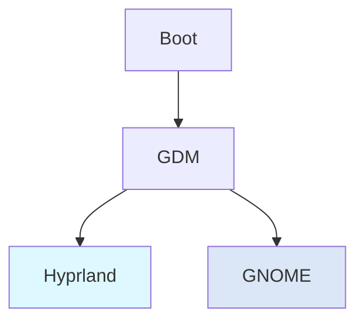
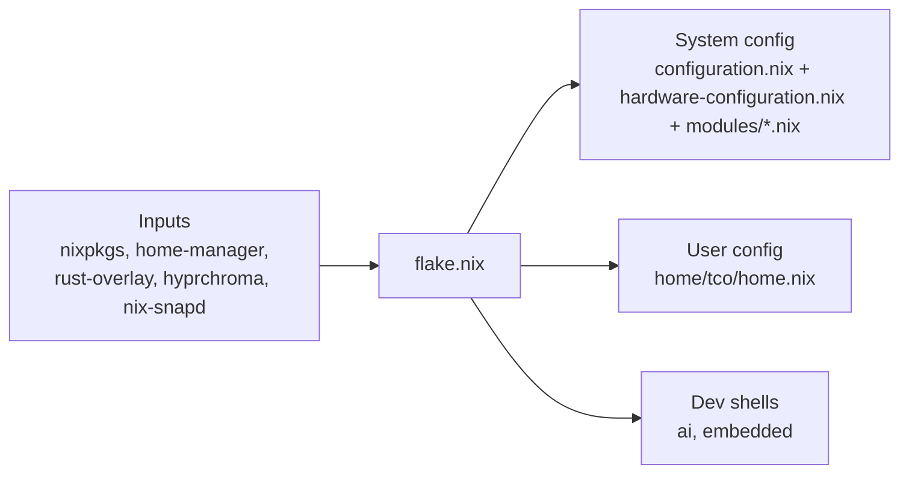
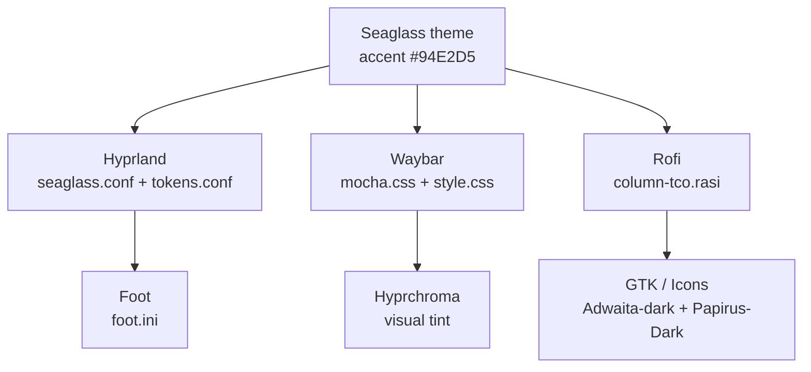

<div align="center">
  
  <h1>NixOS dotfiles</h1>
  <p><strong>Declarative, modular, and optimized workstation configuration</strong></p>

  <div align="center">
    
    
    
    
    
    
  </div>
</div>

---

## Overview

> [!IMPORTANT]
> **Warning**: This configuration is tailored for my hardware. Don't blindly use these settings unless you know what they entail. Use at your own risk!

> [!NOTE]
> This repository uses a modular structure, allowing you to easily toggle specific services (databases, AI, monitoring) by importing the corresponding files in `configuration.nix`.

```
nixos/
├── config/
│   ├── bin/          # Custom scripts
│   ├── doom/         # Doom Emacs
│   ├── foot/         # Terminal
│   └── hypr/         # Hyprland + Waybar
├── home/tco/         # Home Manager
├── modules/          # Toggleable system modules
│   ├── databases.nix
│   ├── nvidia-prime.nix
│   ├── ollama.nix
│   ├── observability.nix
│   └── ...
├── configuration.nix
├── flake.nix
└── flake.lock
```

---

## Preview


<br>


*Desktop Interface — [Waybar Configuration](./config/hypr/waybar) · [Wallpaper](./assets/background.png)*

<br>

> [!TIP]
> This setup ships with **two desktop environments** accessible via GDM — switch seamlessly between **Hyprland** and **GNOME** at login.

#### Session at login


```mermaid
flowchart TB
  Boot["Boot"]
  GDM["GDM"]
  H["Hyprland"]
  G["GNOME"]

  Boot --> GDM
  GDM --> H
  GDM --> G

  style H fill:#58E1FF33
  style G fill:#4A86CF33
```

### GNOME


<br>

### Hyprland


<br>

### Code Environment


*Fully featured Neovim setup for efficient coding and development.*

<br>

### Virtualization


*Seamless virtualization support for running isolated environments and testing.*

<br>

### Hardware & Modeling


*Optimized performance for demanding CAD and 3D modeling workloads.*

<br>

### System Metrics


*Real-time system monitoring and resource management.*

<br>

### Graphics Engine


*Dedicated NVIDIA GPU integration with Prime support for maximum graphics power.*

---

## Diagrams

#### Configuration flow


```mermaid
flowchart LR
  inputs["Inputs<br/>nixpkgs, home-manager,<br/>rust-overlay, hyprchroma, nix-snapd"]
  flake["flake.nix"]
  system["System config<br/>configuration.nix + hardware-configuration.nix + modules/*.nix"]
  home["User config<br/>home/tco/home.nix"]
  shells["Dev shells<br/>ai, embedded"]

  inputs --> flake
  flake --> system
  flake --> home
  flake --> shells
```

#### Theme architecture (Hyprland)


```mermaid
flowchart TB
  theme["Seaglass theme<br/>accent #94E2D5"]
  hypr["Hyprland<br/>seaglass.conf + tokens.conf"]
  waybar["Waybar<br/>mocha.css + style.css"]
  rofi["Rofi<br/>column-tco.rasi"]
  foot["Foot<br/>foot.ini"]
  hyprchroma["Hyprchroma<br/>visual tint"]
  gtk["GTK / Icons<br/>Adwaita-dark + Papirus-Dark"]

  theme --> hypr
  theme --> waybar
  theme --> rofi
  hypr --> foot
  waybar --> hyprchroma
  rofi --> gtk
```

---

## Documentation

The root `README.md` is the main source of truth for this repository. Extra files in `docs/` are only lightweight annexes:

- [`docs/cloc-report.md`](./docs/cloc-report.md) for the generated `cloc` snapshot
- [`docs/specification.txt`](./docs/specification.txt) for a glossary of the configuration
- [`docs/system-overview.puml`](./docs/system-overview.puml) for the PlantUML source

---

## Code Metrics

Generated at: `2026-03-11 15:05:47Z`

### Repository counters

- Nix modules in `modules/`: 14
- Helper scripts in `config/bin/`: 11
- Markdown documents in `docs/`: 1

### cloc report

| Language | files | blank | comment | code |
| -------- | ----: | ----: | ------: | ---: |
| Bourne Again Shell | 40 | 310 | 250 | 1677 |
| Nix | 18 | 166 | 93 | 1174 |
| Bourne Shell | 13 | 100 | 106 | 285 |
| Markdown | 2 | 72 | 0 | 189 |
| JSON | 1 | 13 | 0 | 137 |
| CSS | 2 | 30 | 20 | 125 |
| Text | 1 | 40 | 0 | 98 |
| Lisp | 3 | 22 | 23 | 77 |
| INI | 1 | 7 | 0 | 33 |
| PlantUML | 1 | 4 | 0 | 16 |
| **SUM** | **82** | **764** | **492** | **3811** |

Refresh metrics with:

```bash
nix shell nixpkgs#cloc -c ./scripts/update-metrics.sh
```

The full generated report lives in [`docs/cloc-report.md`](./docs/cloc-report.md).

---

## Installation

### Prerequisites
- [NixOS ISO](https://channels.nixos.org/nixos-unstable/latest-nixos-graphical-x86_64-linux.iso)
- [Ventoy](https://www.ventoy.net/en/download.html) or [Rufus](https://rufus.ie/en/) to create a bootable USB drive.

### Setup Instructions

> [!TIP]
> You can test individual development environments without installing them globally by using `nix develop .#ai` or `nix develop .#embedded`.

1. **Backup your current config**:
   ```bash
   sudo cp -r /etc/nixos /etc/nixos-backup
   ```

2. **Clone this repository**:
   ```bash
   sudo git clone https://github.com/RomeoCavazza/setup-os.git /etc/nixos-new
   sudo cp -r /etc/nixos-new/* /etc/nixos/
   ```

3. **Apply the configuration**:
   ```bash
   cd /etc/nixos
   sudo nixos-rebuild switch --flake .#nixos
   ```

