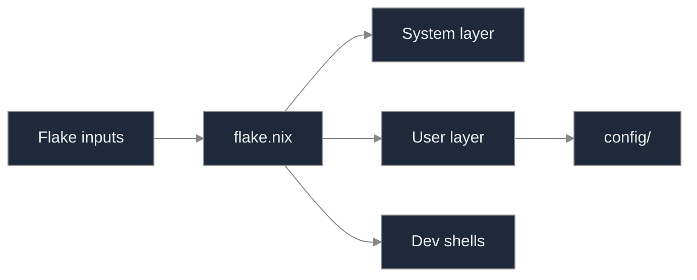
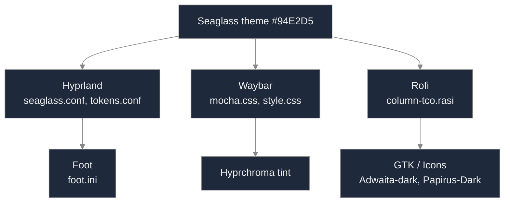
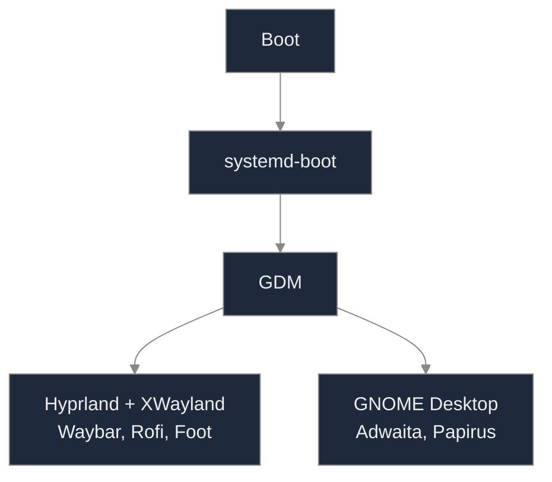
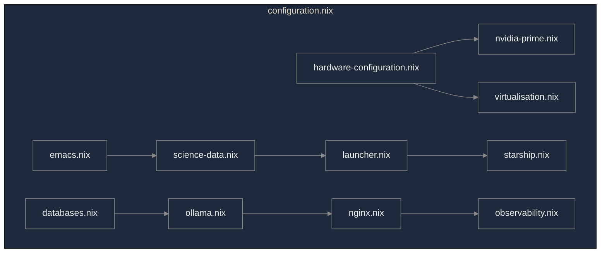
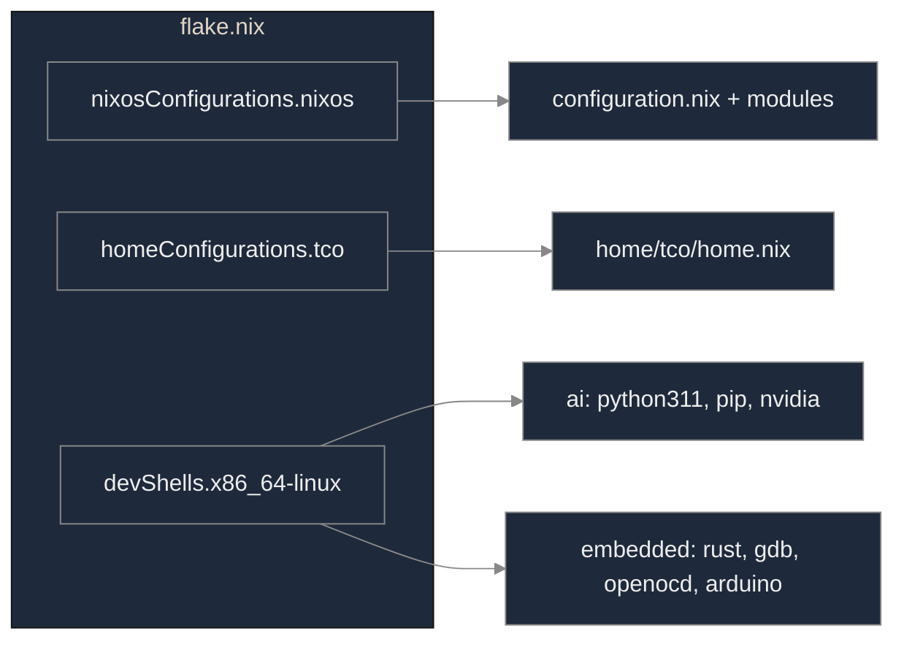

# Documentation

The single source of truth for this repository is the [root README](../README.md). This folder holds annexes only: glossary, raw cloc report, and diagrams (Mermaid in this file; PNG exports in `diagrams/png/`).

---

## Tree of `docs/`

```
docs/
├── README.md           # this file
├── cloc-report.md      # raw cloc output
├── specification.txt   # dense configuration glossary
└── diagrams/
    ├── *.puml          # PlantUML sources (5 files)
    └── png/            # generated images (*.png)
```

---

## 1. Glossary

[**specification.txt**](./specification.txt) — Dense dictionary of the configuration by logical/technical grouping: Nix options, paths, environment variables, commands, modules, diagrams.

---

## 2. Raw cloc results

| Language | files | blank | comment | code |
| -------- | ----: | ----: | ------: | ---: |
| Bourne Again Shell | 40 | 310 | 250 | 1677 |
| Nix | 18 | 166 | 93 | 1174 |
| Markdown | 3 | 92 | 0 | 271 |
| Bourne Shell | 12 | 85 | 103 | 247 |
| Text | 1 | 79 | 0 | 208 |
| JSON | 1 | 13 | 0 | 137 |
| CSS | 2 | 30 | 20 | 125 |
| PlantUML | 5 | 23 | 0 | 94 |
| Lisp | 3 | 22 | 23 | 77 |
| INI | 1 | 7 | 0 | 33 |
| **SUM** | **86** | **827** | **489** | **4043** |

To regenerate from the repository root:

```bash
nix shell nixpkgs#cloc -c cloc . --exclude-dir=.git,node_modules,result,.direnv --md --out=docs/cloc-report.md
```

Full file: [**cloc-report.md**](./cloc-report.md).

---

## 3. Diagrams

Sources: `diagrams/*.puml`. PNG exports: [**diagrams/png/**](./diagrams/png/). To regenerate PNGs from the repository root:

```bash
nix shell nixpkgs#plantuml -c plantuml -tpng -odocs/diagrams/png docs/diagrams/*.puml
```

---

### System overview



The flake is the single entry point: it consumes inputs (nixpkgs, home-manager, rust-overlay, hyprchroma, nix-snapd) and produces the system configuration (configuration.nix, hardware-configuration.nix, modules), the user configuration (home/tco/home.nix), and dev shells (ai, embedded).

---

### Seaglass theme propagation



The Seaglass visual theme (accent #94E2D5) is applied in the config layer (Hyprland, Waybar, Rofi) and then in rendering (Foot, Hyprchroma, GTK/icons Adwaita-dark and Papirus-Dark).

---

### Boot and session choice



At boot, systemd-boot then GDM allow choosing Hyprland (XWayland, Waybar, Rofi, Foot) or GNOME (Adwaita, Papirus).

---

### Module imports (configuration.nix)



configuration.nix imports hardware-configuration.nix and optional modules (nvidia-prime, virtualisation, emacs, science-data, launcher, starship, databases, ollama, nginx, observability). Optional links mainly concern hardware (nvidia-prime, virtualisation).

---

### Flake outputs



The flake exposes nixosConfigurations.nixos (full system config), homeConfigurations.tco (Home Manager), and devShells (ai: Python/pip/NVIDIA; embedded: Rust, gdb, openocd, Arduino, etc.).
