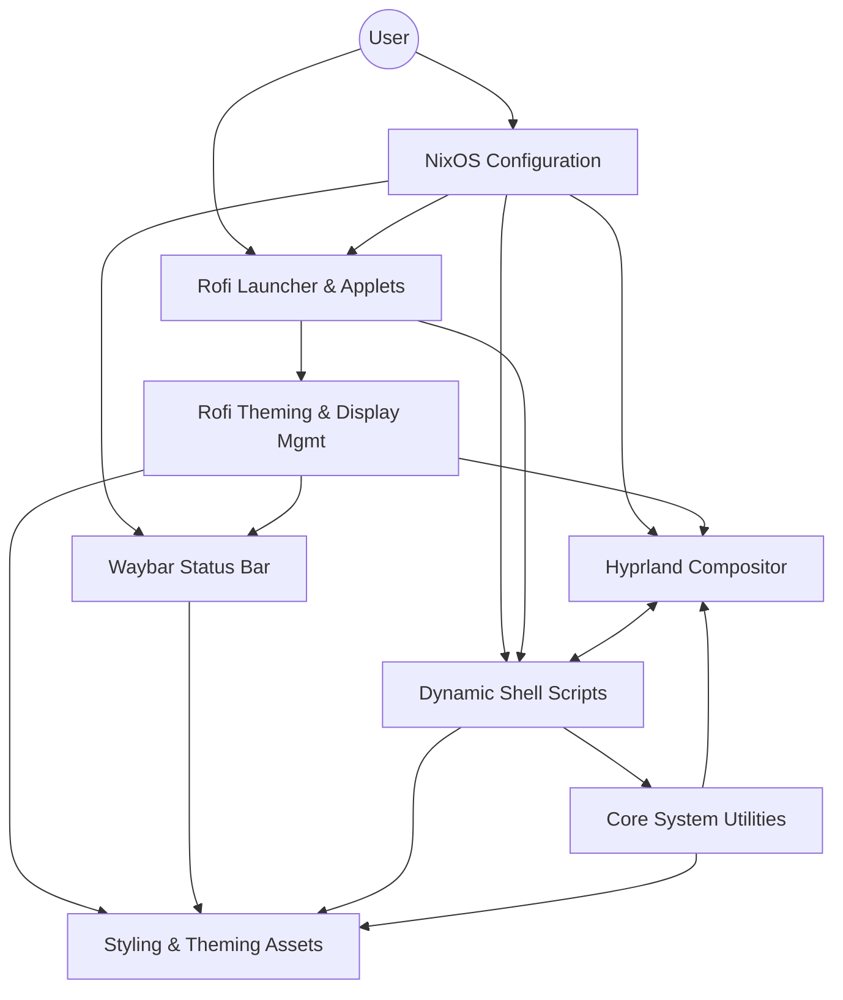
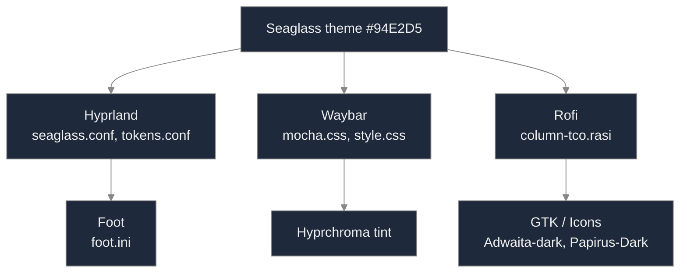
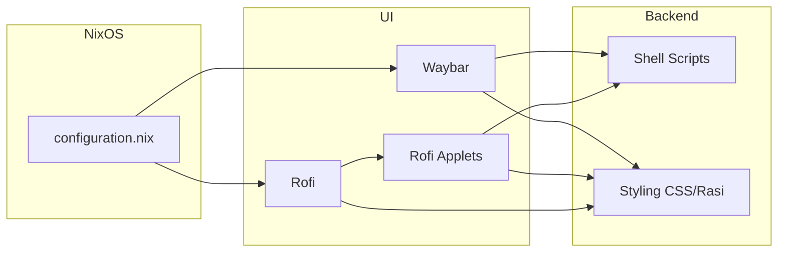
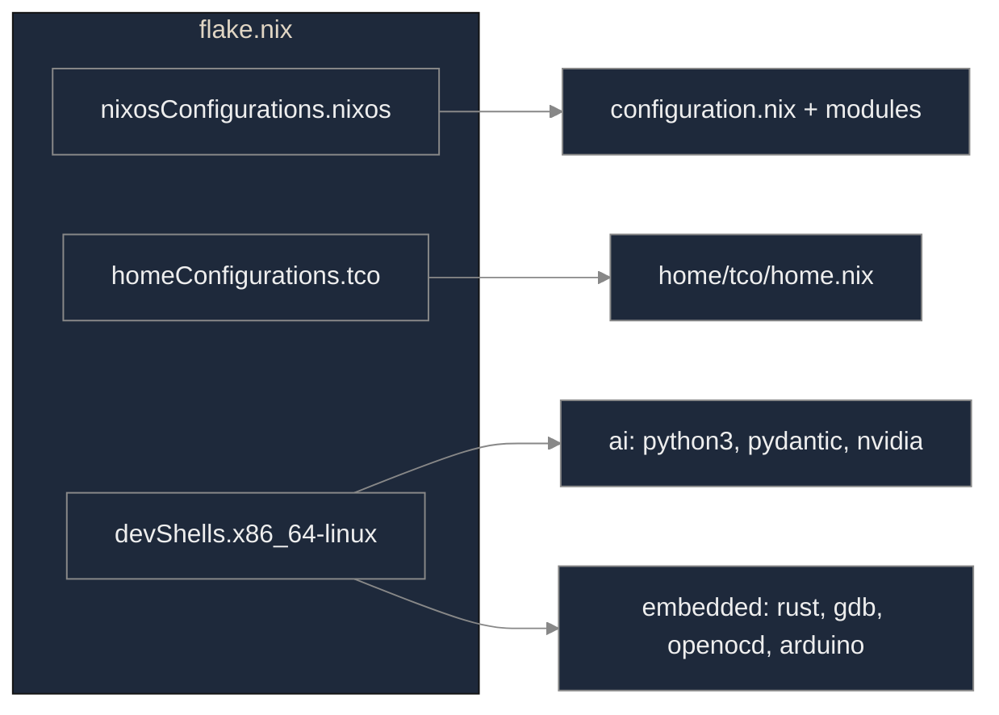

# Technical Deep Dive
Powered by Gemini

This folder contains the technical documentation annexes for the `setup-os` configuration. It focuses on the internal logic, architectural dependencies, and automated workflows that power the user interface.

## NixOS Workstation Configuration

The NixOS workstation configuration located in (root) provides a declarative, modular, and optimized system setup. This configuration is managed using Nix flakes, which enables reproducible and portable deployment. It supports multiple desktop environments, including Hyprland and GNOME, and integrates various development environments, which can be tested in isolation. The core system configuration is handled by `configuration.nix`, which incorporates modular components allowing for the selective inclusion of features such as database support, NVIDIA Prime integration, and system observability tools.

User interface components, particularly Waybar and Rofi, are extensively configured within the `config` directory. Waybar is configured for dynamic audio visualization, displaying active window information, and thematic styling. For more specific details on Waybar's configuration, refer to Waybar Configuration. Rofi is utilized through a comprehensive suite of applets that facilitate system interaction and control, including application launching, system settings management, media playback control, power management, and screenshot capabilities. These Rofi applets feature dynamic theming and color scheme selections, providing a varied aesthetic experience. The management of Rofi's display also involves dynamic adjustments to Hyprland's window gaps and interactions with Waybar for notifications and restarts.

---

## 1. System Architecture

This diagram illustrates the high-level relationship between the NixOS declarative layer and the dynamic runtime components (scripts, UI, and styling).

[Source: system-architecture.puml](./diagrams/system-architecture.puml) | [Export: system-architecture.png](./diagrams/png/system-architecture.png)

---

## 2. Waybar Configuration & Seaglass Theme

The Waybar configuration, located primarily within `config/hypr/waybar`, provides a highly customizable status bar for Wayland compositors, specifically integrated into the Hyprland environment. This setup includes dynamic audio visualization, active window information display, and comprehensive thematic styling using CSS. The configuration ensures a consistent visual aesthetic and interactive experience, working in concert with other system components like Rofi.

The Waybar's visual appearance is managed through a modular CSS approach. A core color palette is defined in `config/hypr/waybar/mocha.css` using CSS `@define-color` at-rules. These definitions establish a consistent set of hexadecimal color values, based on the "Mocha" theme. This palette is then imported by `config/hypr/waybar/style.css`, which applies specific visual styles to various Waybar elements, including the main bar, clock, battery, CPU, taskbar, and workspaces.

### Seaglass Theme Propagation

The Seaglass visual theme (accent #94E2D5) is propagated from the config layer down to the rendering engines and GTK elements, ensuring a unified aesthetic.

[Source: theme-flow.puml](./diagrams/theme-flow.puml) | [Export: theme-flow.png](./diagrams/png/theme-flow.png)

---

## 3. Integration Logic & Dynamic Scripts

This visualization shows how `configuration.nix` acts as the orchestrator, integrating various UI components that in turn rely on shared shell scripts and styling assets.

[Source: integration-logic.puml](./diagrams/integration-logic.puml) | [Export: integration-logic.png](./diagrams/png/integration-logic.png)

### Dynamic Audio Visualization with Cava
Waybar integrates with `cava` for dynamic audio visualization through a dedicated script at `config/hypr/waybar/WaybarCava.sh`. This script manages the `cava` process, generating its configuration (PulseAudio input, ASCII raw output), and processing that output into graphical bar characters for real-time display. It also includes logic to suppress output during silence.

### Active Window Information Display
The script `config/hypr/waybar/activeapp.sh` queries Hyprland for active window metadata. It extracts the window class and title using `hyprctl` and `jq`, then maps common classes to Nerd Font icons (e.g., Firefox -> , Code -> 󰨞). The resulting JSON payload is consumed by Waybar to provide visual context in the status bar.

---

## 4. Rofi-based System Interaction Applets

The `config/rofi` directory provides a collection of rofi-based applets for system interaction and control. These applets offer graphical interfaces for common tasks: application launching, backlight and volume control, battery monitoring, media control via MPD, power management, quick web access, and screenshots.

### Execution Flow: Launcher & Grid

```mermaid
sequenceDiagram
  participant L as launcher.sh
  participant C as colors.rasi
  participant R as Rofi
  participant G as rofi-grid.sh
  participant H as Hyprland
  participant W as Waybar

  L->>C: Randomize Accent
  L->>R: Launch Theme
  rect rgb(30, 41, 59)
    R->>G: Launch Grid Context
    G->>H: Blur Adjustment
    G->>W: Kill waybar
  end
  R->>G: Exit Context
  G->>H: Restore Blur
  G->>W: Relaunch waybar
```

This sequence documents the complex coordination required when launching the Rofi grid, including dynamic blur adjustment in Hyprland and process management for Waybar.

[Source: rofi-launcher-flow.puml](./diagrams/rofi-launcher-flow.puml) | [Export: rofi-launcher-flow.png](./diagrams/png/rofi-launcher-flow.png)

### Rofi Dynamic Gap Management
The script `config/rofi/scripts/rofi-push.sh` dynamically adjusts Hyprland's window gaps to accommodate Rofi. It calculates a shifted layout (typically pushing windows right or left) by modifying `general:gaps_out` via `hyprctl`, and restores the original layout once Rofi exits.

---

## 5. Flake Outputs

The flake exposes the full system configuration, user-level Home Manager settings, and specialized development shells for AI and embedded work.

[Source: flake-outputs.puml](./diagrams/flake-outputs.puml) | [Export: flake-outputs.png](./diagrams/png/flake-outputs.png)
