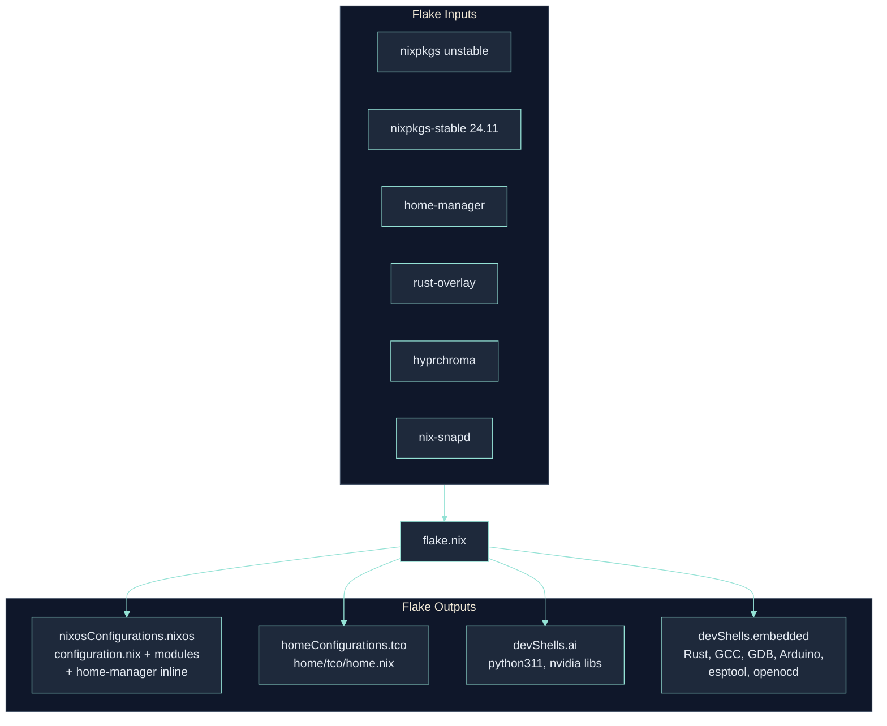
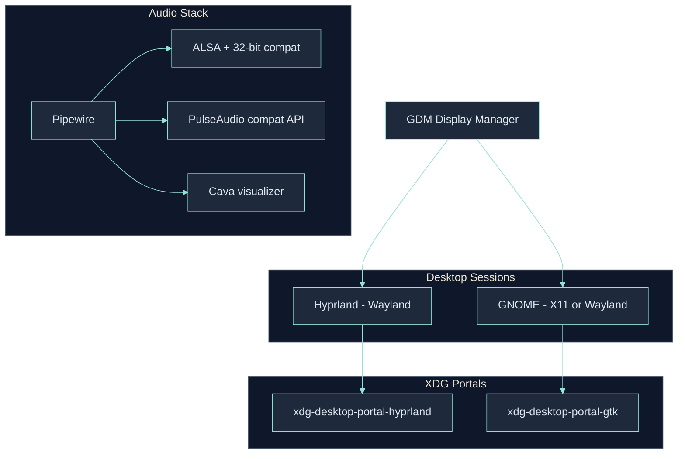
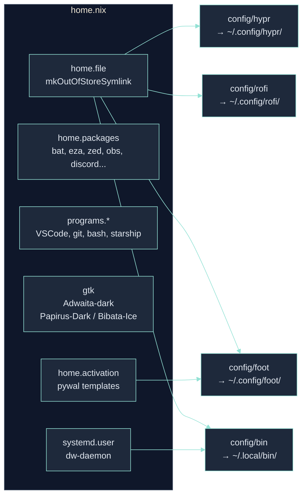
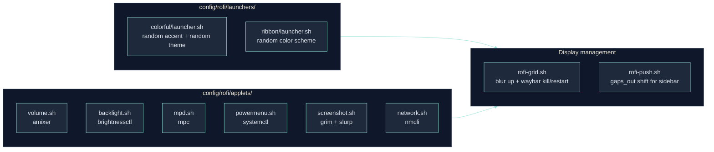
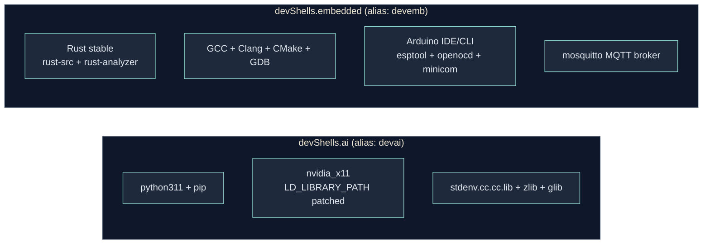

# Technical Deep Dive
Powered by Gemini

Technical documentation annexes for the `setup-os` NixOS configuration — covering every layer of the system in dependency order, each section illustrated with a diagram.

---

## 1. Nix Flake Structure

The entire system is defined by a single `flake.nix`. It acts as the entry point for everything: system builds, user environments, and development shells.



The flake pins six inputs. `nixpkgs` (unstable) is the primary package set; `nixpkgs-stable` is used exclusively for Guix, which requires a stable release. `rust-overlay` injects Nightly/Stable Rust toolchains into the package set via an overlay. `hyprchroma` is a Hyprland plugin that applies a GPU shader tint to inactive windows. `nix-snapd` provides a NixOS module enabling Canonical Snap on NixOS.

The `nixosConfigurations.nixos` output is the main system builder. It includes `configuration.nix`, all optional modules from `modules/`, and Home Manager is embedded inline (`home-manager.nixosModules.home-manager`), so a single `sudo nixos-rebuild switch` applies both system and user config atomically.

[Source: flake-outputs.puml](./diagrams/flake-outputs.puml) | [Export: flake-outputs.png](./diagrams/png/flake-outputs.png)

---

## 2. System Layer — `configuration.nix` and Modules

`configuration.nix` is the NixOS entry point. All optional system behaviors are extracted into discrete modules under `modules/` and explicitly listed in the `imports` list.

```mermaid
%%{init: {'theme': 'base', 'themeVariables': { 'primaryColor': '#1e293b', 'secondaryColor': '#0f172a', 'tertiaryColor': '#0f172a', 'primaryBorderColor': '#94e2d5', 'lineColor': '#94e2d5', 'primaryTextColor': '#e2e8f0', 'clusterBkg': '#0f172a', 'clusterBorder': '#475569' }}}%%
flowchart LR
  hw[hardware-configuration.nix]

  subgraph core["configuration.nix core"]
    boot["Boot\nsystemd-boot + Windows entry"]
    nixrt["Nix Runtime\nauto-optimise, sandbox, GC"]
    net["Network\nNetworkManager + blueman"]
    svc["Services\nGDM, Pipewire, polkit, flatpak, snap, guix"]
    nld["nix-ld\nForeign binary support"]
  end

  subgraph mods["modules/"]
    nv["nvidia-prime.nix\nPRIME offload Intel+NVIDIA"]
    vm["virtualisation.nix\nDocker, KVM, ARM binfmt"]
    em["emacs.nix + science-data.nix\nstarship.nix + launcher.nix"]
    db["databases.nix + ollama.nix\nnginx.nix + observability.nix"]
  end

  hw --> core
  core --> mods
```



Currently active modules:

| Module | Purpose |
|--------|---------|
| `nvidia-prime.nix` | NVIDIA PRIME offload (hybrid Intel/NVIDIA) |
| `virtualisation.nix` | Docker, libvirt/KVM, QEMU, ARM binfmt emulation |
| `emacs.nix` | Doom Emacs + dependencies |
| `science-data.nix` | Scientific computing packages |
| `launcher.nix` | Rofi launchers system integration |
| `starship.nix` | Starship prompt configuration |
| `databases.nix` | Local database services |
| `ollama.nix` | Ollama local LLM daemon |
| `nginx.nix` | Nginx reverse proxy |
| `observability.nix` | System monitoring and metrics |

### Boot: systemd-boot

The bootloader is `systemd-boot` with strict hardening: `configurationLimit = 1` restricts the menu to one NixOS entry (no rollback accumulation), and a custom `windows.conf` entry is injected into the EFI loader to dual-boot Windows 11. Kernel modules `i2c-dev` and `i2c-i801` are explicitly loaded for hardware sensor support. Kernel parameters include `nvidia-drm.modeset=1` (required for Wayland) and `pcie_aspm=off` (disables PCIe power saving for stability).

### Nix Runtime

```
auto-optimise-store = true   # hard-link deduplication across store
sandbox-build-dir = "/build" # bind-mounted from /home/nix-build to avoid /tmp bloat
gc.dates = "weekly"          # auto-prune entries older than 7 days
```

### Hardware — NVIDIA PRIME (`nvidia-prime.nix`)

Hybrid graphics setup: Intel iGPU for display output, NVIDIA dGPU for compute offloading. `prime.offload = true` keeps the GPU idle by default; `nvidia-offload <cmd>` routes a specific process to the dGPU. `powerManagement.finegrained = true` allows the NVIDIA GPU to power-gate when idle. Bus IDs: Intel at `PCI:0:2:0`, NVIDIA at `PCI:2:0:0`.

### Virtualisation (`virtualisation.nix`)

- **Docker**: enabled with weekly autoPrune (`--all --volumes`). Managed with `lazydocker` and `docker-compose`.
- **KVM/libvirt**: `virt-manager` as GUI, `quickemu` for rapid VM creation (Windows, macOS, Linux).
- **ARM binfmt emulation**: `boot.binfmt.emulatedSystems = [ "aarch64-linux" ]` allows running AArch64 binaries natively, enabling SD card image building for Raspberry Pi and Jetson targets directly from this x86_64 host.

[Source: system-architecture.puml](./diagrams/system-architecture.puml) | [Export: system-architecture.png](./diagrams/png/system-architecture.png)

---

## 3. Display, Audio & Connectivity



### Display Stack

The system runs a hybrid DM setup: GDM manages session selection, offering both a **Hyprland** (Wayland) and a **GNOME** (X11/Wayland) session. XDG portals are configured for both backends, ensuring screen sharing, file pickers, and other portal-based features work correctly in both sessions.

### Audio: Pipewire

The audio stack uses Pipewire with the full compatibility layer: ALSA (with 32-bit support for Steam and legacy apps) and the PulseAudio compatibility API for apps that don't natively support Pipewire. `cava` is available as a standalone visualizer and is also used by the Waybar module.

### nix-ld: Running Foreign Binaries

`programs.nix-ld` provides a compatibility shim for non-Nix ELF binaries (AppImages, pre-built tools, proprietary SDKs). A curated library set is injected: `glib`, `gtk3`, `mesa`, `libx11`, `libxcb`, `libdrm`, `nss`, and more. This allows tools like the Cursor editor AppImage to run without manual patching.

[Source: display-audio.puml](./diagrams/display-audio.puml) | [Export: display-audio.png](./diagrams/png/display-audio.png)

---

## 4. User Layer — `home/tco/home.nix`

Home Manager runs inline within the system build. The user configuration manages dotfiles, packages, services, and shell environment.



### Dotfile Strategy

All configuration files are managed via `home.file` entries pointing to `mkOutOfStoreSymlink`, which creates **mutable symlinks outside the Nix store**. This means config files in `config/` can be edited live without a `nixos-rebuild`:

```
~/.config/hypr       → /etc/nixos/config/hypr/
~/.config/waybar     → /etc/nixos/config/hypr/waybar/
~/.config/rofi       → /etc/nixos/config/rofi/
~/.config/foot       → /etc/nixos/config/foot/
```

### Session Environment

```
QT_QPA_PLATFORM = "wayland"          # Force Qt apps to Wayland
QT_STYLE_OVERRIDE = "kvantum"        # Use Kvantum for Qt theming
ELECTRON_OZONE_PLATFORM_HINT = "x11" # Electron fallback for stability
~/.lmstudio/bin, ~/.npm-global/bin, ~/.local/bin  # added to $PATH
```

### Key User Packages

| Category | Packages |
|----------|----------|
| Shell tools | `bat`, `eza`, `fzf`, `zoxide`, `yazi`, `superfile` |
| Editors | `zed-editor`, `neovim`, VSCode (Nix/Python/Rust/C++ extensions) |
| AI coding | `aider-chat`, Cursor (AppImage via `cursor` wrapper), `antigravity` |
| Development | `rustc`, `cargo`, `nodejs_22`, `pnpm`, `typescript-language-server` |
| Creative | `obs-studio`, `discord`, `spotify`, `kicad` |
| Terminal fun | `cmatrix`, `cbonsai`, `pipes`, `hollywood`, `terminal-rain-lightning` |
| Theming | `pywal`, `wpgtk`, `cava`, `hyprcursor`, `rose-pine-hyprcursor` |

### DarkWindow Plugin (`dw-daemon`)

`hypr-darkwindow` is a Hyprland plugin (`.so`) that shades inactive windows. The daemon runs as a `systemd.user.service` attached to `graphical-session.target`. Scripts `dw-toggle`, `dw-toggle-global`, and `dw-apply` allow toggling from the command line or via Hyprland keybinds.

### Pywal / Wpgtk Integration

`pywal` generates a color palette from wallpapers and writes templates to `~/.cache/wal/`. Two templates are provisioned at activation time via `home.activation`:
- `colors-hyprland.conf` — sets `col.active_border` and `col.inactive_border` dynamically from wallpaper palette
- `colors-foot.ini` — injects the generated palette into the Foot terminal color scheme

### Shell & Prompt

Bash with Starship prompt. Key aliases:
```bash
rebuild  # sudo nixos-rebuild switch --flake /etc/nixos#nixos
hm       # home-manager switch --flake /etc/nixos#tco
devai    # nix develop /etc/nixos#ai
devemb   # nix develop /etc/nixos#embedded
```

[Source: user-layer.puml](./diagrams/user-layer.puml) | [Export: user-layer.png](./diagrams/png/user-layer.png)

---

## 5. Desktop Environment — Hyprland + Seaglass Theme

Hyprland is a tiling Wayland compositor with XWayland enabled for compatibility with X11 applications. Its configuration lives in `config/hypr/`.

```mermaid
%%{init: {'theme': 'base', 'themeVariables': { 'primaryColor': '#1e293b', 'secondaryColor': '#0f172a', 'tertiaryColor': '#0f172a', 'primaryBorderColor': '#94e2d5', 'lineColor': '#94e2d5', 'primaryTextColor': '#e2e8f0', 'clusterBkg': '#0f172a', 'clusterBorder': '#475569' }}}%%
flowchart TB
  src["Seaglass Source\nseaglass.conf + tokens.conf\naccent: #94E2D5"]

  subgraph compositor["Hyprland Compositor"]
    borders["Active border: #94E2D5\n12px rounding, dual-border"]
    dw["hypr-darkwindow\nInactive window tint"]
    hc["hyprchroma\nGPU shader overlay"]
  end

  subgraph bar["Waybar"]
    mocha["mocha.css\nCatppuccin palette"]
    style["style.css\naccent: #94e2d5"]
  end

  rofi["Rofi\ncolumn-tco.rasi\naccent injected via colors.rasi"]
  foot["Foot terminal\ncolors-foot.ini from pywal template"]
  gtk["GTK: Adwaita-dark\nIcons: Papirus-Dark\nCursor: Bibata-Modern-Ice"]

  src --> compositor
  src --> bar
  src --> rofi
  compositor --> foot
  bar --> hc
  src --> gtk
```

The Seaglass theme uses a teal accent (`#94E2D5`). It is propagated at the config layer — not injected at runtime — so the visual identity is stable across every component:

- **Hyprland**: `seaglass.conf` sets border colors, rounding (12px), and active/inactive states. `tokens.conf` defines shared base values.
- **hyprchroma**: A GPU shader applied on top of all windows for an additional color tint layer.
- **hypr-darkwindow**: A plugin that darkens inactive windows, improving focus contrast.
- **Waybar**: `mocha.css` imports the full Catppuccin Mocha palette as CSS variables. `style.css` imports it and defines `accent: #94e2d5`, applying teal to borders, hover states, and active module backgrounds.
- **Rofi**: `colors.rasi` is overwritten by launcher scripts with a randomly selected accent per invocation.
- **Foot terminal**: Themed via the `pywal` `colors-foot.ini` template, tied to the wallpaper palette.
- **GTK**: Adwaita-dark theme, Papirus-Dark icon set, Bibata-Modern-Ice cursor.

[Source: theme-flow.puml](./diagrams/theme-flow.puml) | [Export: theme-flow.png](./diagrams/png/theme-flow.png)

---

## 6. Waybar — Status Bar

Waybar is the Wayland status bar. Its config is in `config/hypr/waybar/` and symlinked to `~/.config/waybar/`.


### Dynamic Audio Visualization — `WaybarCava.sh`

The script generates a temporary Cava config on each launch (`/tmp/bar_cava_config`) with 14 bars at 60fps over PulseAudio. It pipes Cava's raw ASCII output through `sed` (character substitution) and `awk` (silence masking), outputting unicode bar characters consumed by Waybar's `custom/cava` module.

### Active Window — `activeapp.sh`

Queries `hyprctl activewindow` for the focused window's class and title. Maps classes to Nerd Font icons via a `case` statement (e.g., `firefox` → , `code` → 󰨞, `foot` → ). Outputs `{"text":"icon","tooltip":"Full Window Title"}` JSON for Waybar.

### Thematic Styling

`mocha.css` defines the full Catppuccin Mocha palette as CSS custom properties. `style.css` imports it and overrides the accent to `#94e2d5`. Key styles: transparent bar background, `border-radius: 999px` on modules, and hover states using `rgba(148, 226, 213, 0.12)` for a subtle teal glow.

[Source: integration-logic.puml](./diagrams/integration-logic.puml) | [Export: integration-logic.png](./diagrams/png/integration-logic.png)

---

## 7. Rofi — Launchers & Applets

Rofi handles application launch and system controls via a suite of themed applets in `config/rofi/`.



Each launcher script randomizes a color accent by selecting a random entry from a `colors/` subdirectory and overwriting `colors.rasi` before invoking Rofi. `rofi-grid.sh` temporarily increases `blur_size` and kills Waybar on open, restoring both on close. `rofi-push.sh` shifts `gaps_out` to create space for the sidebar layout without overlapping windows.

[Source: rofi-launcher-flow.puml](./diagrams/rofi-launcher-flow.puml) | [Export: rofi-launcher-flow.png](./diagrams/png/rofi-launcher-flow.png)

---

## 8. Development Shells

The flake exposes two development environments accessible via `nix develop`.



| Shell | Alias | Contents |
|-------|-------|---------|
| `#ai` | `devai` | Python 3.11, pip, NVIDIA libs, `LD_LIBRARY_PATH` patched for CUDA |
| `#embedded` | `devemb` | Rust (stable + `rust-src` + `rust-analyzer`), GCC, Clang, CMake, GDB, Arduino IDE/CLI, esptool, openocd, minicom, mosquitto |

The `#ai` shell explicitly sets `LD_LIBRARY_PATH` to expose `stdenv.cc.cc.lib` and `nvidia_x11` for Python packages that load native CUDA extensions (e.g., PyTorch). The `#embedded` shell uses `rust-overlay` to pin a precise Rust stable release, ensuring reproducibility. The `arduino-ide`, `esptool`, and `openocd` combination covers the full embedded lifecycle: IDE → compilation → flashing → JTAG debugging.

[Source: dev-shells.puml](./diagrams/dev-shells.puml) | [Export: dev-shells.png](./diagrams/png/dev-shells.png)
