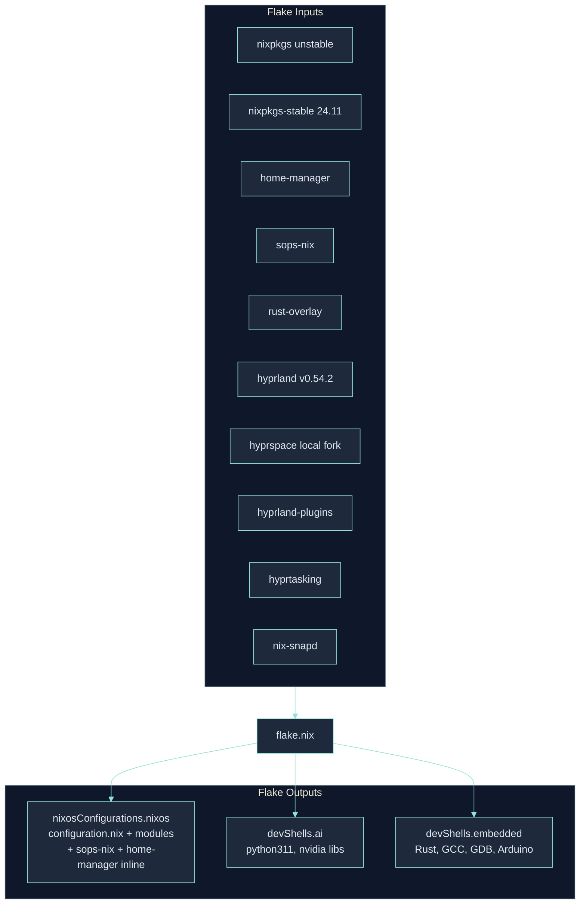
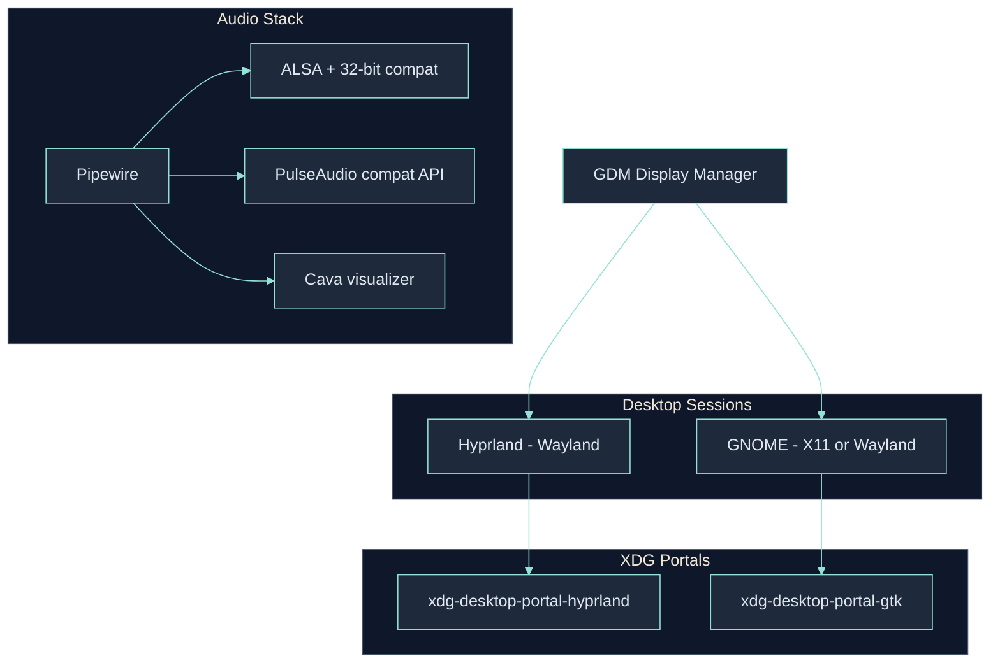
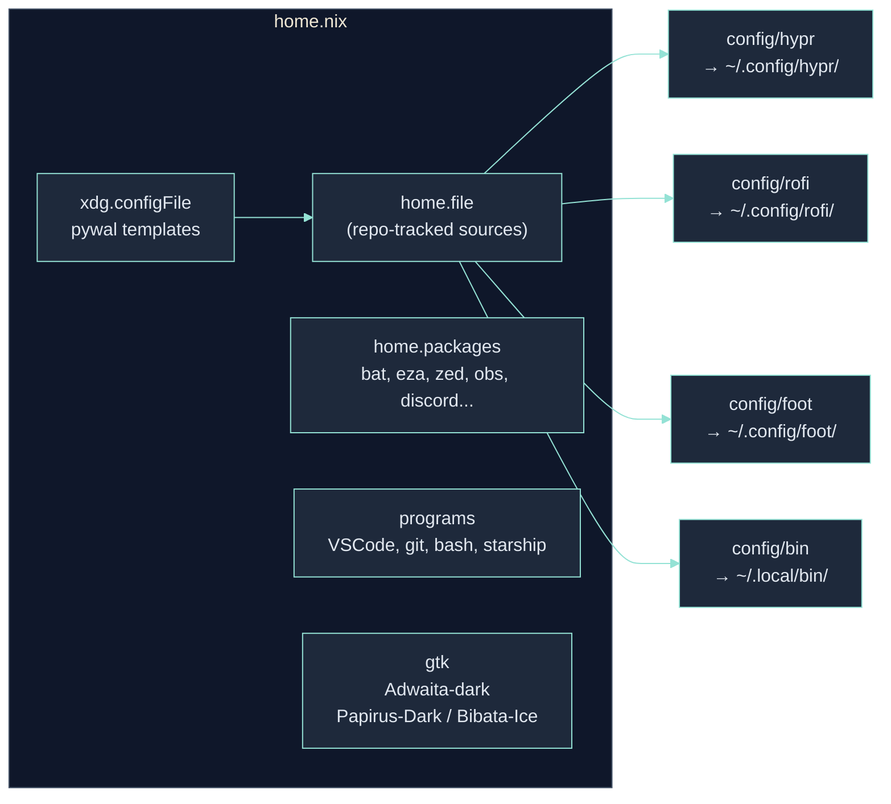
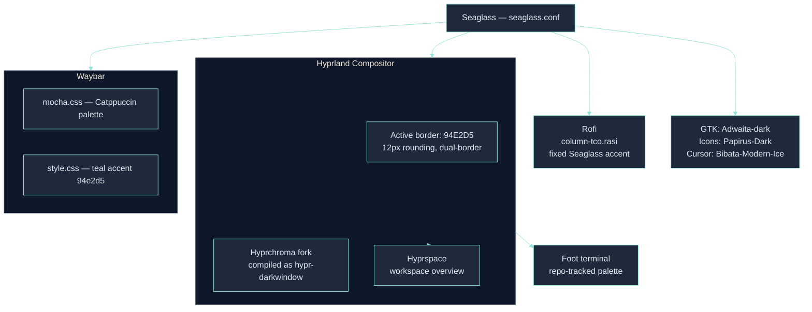
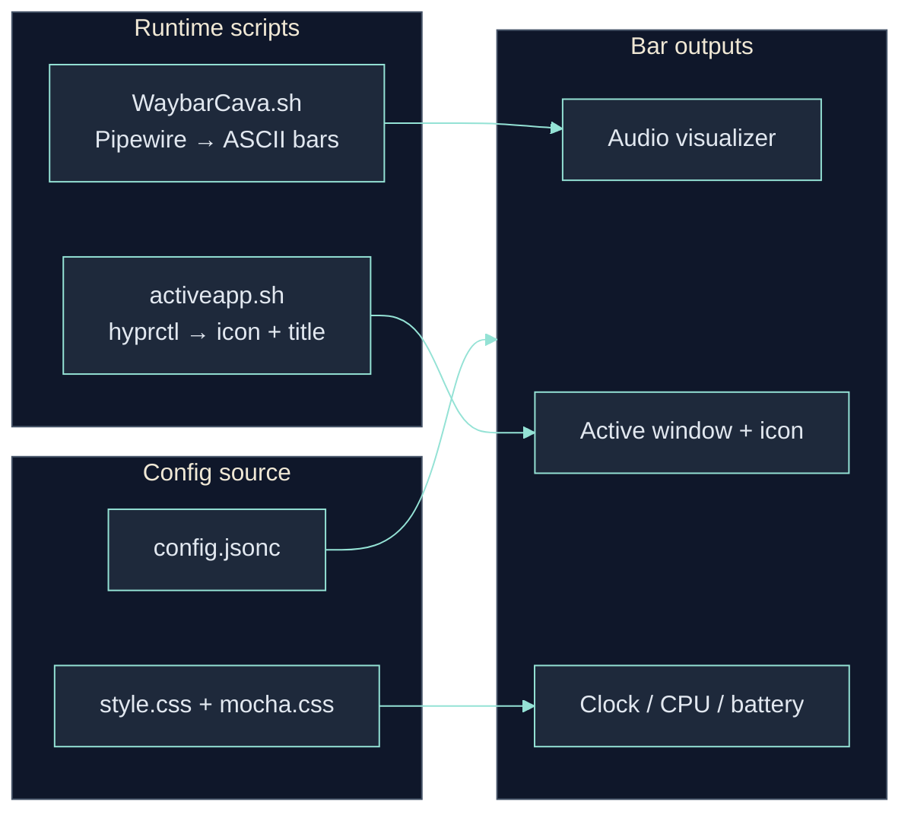
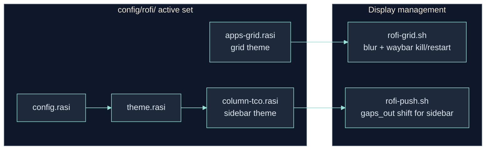
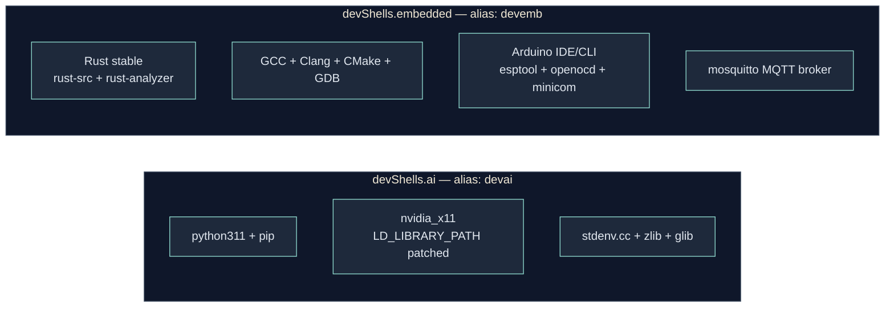

# Technical Deep Dive

Technical documentation annexes for the `setup-os` NixOS configuration — covering every layer of the system in dependency order, each section illustrated with a diagram.

---

## 1. Nix Flake Structure

The entire system is defined by a single `flake.nix`. It acts as the entry point for everything: system builds, user environments, and development shells.



> [Source: flake-outputs.puml](./diagrams/flake-outputs.puml) | [Export: flake-outputs.png](./diagrams/png/flake-outputs.png)

The flake currently pins ten inputs. `nixpkgs` (unstable) is the primary package set; `nixpkgs-stable` is used exclusively for Guix, which requires a stable release. `rust-overlay` injects Nightly/Stable Rust toolchains into the package set via an overlay. `hyprland` is pinned to `v0.54.2`. `hyprspace` is sourced from a local fork tracked in this repository. `hyprland-plugins` and `hyprtasking` are kept available for optional integrations. `nix-snapd` provides a NixOS module enabling Canonical Snap on NixOS. `sops-nix` injects declarative secret management used by the backup stack.

The `nixosConfigurations.nixos` output is the sole entry point. It includes `configuration.nix`, flake-level modules such as `sops-nix` and `modules/backup.nix`, and Home Manager is embedded inline (`home-manager.nixosModules.home-manager`), so a single `sudo nixos-rebuild switch` applies system config, secrets wiring, backup units, and user config atomically.

---

## 2. System Layer — `configuration.nix` and Modules

`configuration.nix` is the NixOS entry point. All optional system behaviors are extracted into discrete modules under `modules/` and explicitly listed in the `imports` list.

```mermaid
%%{init: {'theme': 'base', 'themeVariables': { 'primaryColor': '#1e293b', 'secondaryColor': '#0f172a', 'tertiaryColor': '#0f172a', 'primaryBorderColor': '#94e2d5', 'lineColor': '#94e2d5', 'primaryTextColor': '#e2e8f0', 'clusterBkg': '#0f172a', 'clusterBorder': '#475569' }}}%%
flowchart LR
  hw[hardware-configuration.nix]

  subgraph core["configuration.nix"]
    boot["Boot\nsystemd-boot + Windows dual-boot"]
    nixrt["Nix Runtime\nauto-optimise, sandbox, GC weekly"]
    net["Network\nNetworkManager + blueman"]
    svc["Services\nGDM, Pipewire, polkit, flatpak, snap, guix"]
    nld["nix-ld\nForeign binary support"]
  end

  subgraph mods["modules/ — system only"]
    nv["nvidia-prime.nix\nPRIME offload Intel + NVIDIA"]
    vm["virtualisation.nix\nDocker, KVM, ARM binfmt"]
    em["emacs.nix + launcher.nix"]
    db["databases + ollama\nnginx + observability"]
  end

  subgraph hmmods["home/tco/modules/apps/ — user"]
    cad["cad.nix\nobsidian · kicad · freecad"]
    emb["embedded.nix\narduino · esptool · minicom"]
    dat["data.nix\ndbeaver · grafana · influxdb2"]
  end

  hw --> core
  core --> mods
```



> [Source: system-architecture.puml](./diagrams/system-architecture.puml) | [Export: system-architecture.png](./diagrams/png/system-architecture.png)

Currently active modules:

**System modules (`modules/`):**

| Module | Purpose |
|--------|---------|
| `nvidia-prime.nix` | NVIDIA PRIME offload (hybrid Intel/NVIDIA) |
| `virtualisation.nix` | Docker, libvirt/KVM, QEMU, ARM binfmt emulation |
| `emacs.nix` | Doom Emacs + dependencies |
| `launcher.nix` | Launcher-related system integration |
| `databases.nix` | Local database services |
| `ollama.nix` | Ollama local LLM daemon |
| `nginx.nix` | Nginx reverse proxy |
| `observability.nix` | System monitoring and metrics |
| `backup.nix` | Encrypted `restic` backups to Backblaze B2 via `sops-nix` |

**User modules (`home/tco/modules/apps/`):**

| Module | Packages |
|--------|----------|
| `cad.nix` | `obsidian`, `kicad`, `freecad` |
| `embedded.nix` | `arduino-ide`, `arduino-cli`, `esptool`, `minicom` |
| `data.nix` | `dbeaver-bin`, `grafana`, `influxdb2` |

### Boot: systemd-boot

The bootloader is `systemd-boot` with strict hardening: `configurationLimit = 1` restricts the menu to one NixOS entry (no rollback accumulation), and a custom `windows.conf` entry is injected into the EFI loader to dual-boot Windows 11. Kernel modules `i2c-dev` and `i2c-i801` are explicitly loaded for hardware sensor support. Kernel parameters include `nvidia-drm.modeset=1` (required for Wayland) and `pcie_aspm=off` (disables PCIe power saving for stability).

### Nix Runtime

```
auto-optimise-store = true   # hard-link deduplication across store
sandbox-build-dir = "/build" # bind-mounted from /home/nix-build to avoid /tmp bloat
gc.dates = "weekly"          # auto-prune entries older than 7 days
```

### Hardware — NVIDIA PRIME (`nvidia-prime.nix`)

Hybrid graphics setup: Intel iGPU for display output, NVIDIA dGPU for compute offloading. `prime.offload = true` keeps the GPU idle by default; `nvidia-offload <cmd>` routes a specific process to the dGPU. `powerManagement.finegrained = true` allows the NVIDIA GPU to power-gate when idle. Bus IDs: Intel at `PCI:0:2:0`, NVIDIA at `PCI:2:0:0`.

### Virtualisation (`virtualisation.nix`)

- **Docker**: enabled with weekly autoPrune (`--all --volumes`). Managed with `lazydocker` and `docker-compose`.
- **KVM/libvirt**: `virt-manager` as GUI, `quickemu` for rapid VM creation (Windows, macOS, Linux).
- **ARM binfmt emulation**: `boot.binfmt.emulatedSystems = [ "aarch64-linux" ]` allows running AArch64 binaries natively, enabling SD card image building for Raspberry Pi and Jetson targets directly from this x86_64 host.

---

## 3. Display, Audio & Connectivity



> [Source: display-audio.puml](./diagrams/display-audio.puml) | [Export: display-audio.png](./diagrams/png/display-audio.png)

### Display Stack

The system runs a hybrid DM setup: GDM manages session selection, offering both a **Hyprland** (Wayland) and a **GNOME** (X11/Wayland) session. XDG portals are configured for both backends, ensuring screen sharing, file pickers, and other portal-based features work correctly in both sessions.

### Audio: Pipewire

The audio stack uses Pipewire with the full compatibility layer: ALSA (with 32-bit support for Steam and legacy apps) and the PulseAudio compatibility API for apps that don't natively support Pipewire. `cava` is available as a standalone visualizer and is also used by the Waybar module.

### nix-ld: Running Foreign Binaries

`programs.nix-ld` provides a compatibility shim for non-Nix ELF binaries (AppImages, pre-built tools, proprietary SDKs). A curated library set is injected: `glib`, `gtk3`, `mesa`, `libx11`, `libxcb`, `libdrm`, `nss`, and more. This allows tools like the Cursor editor AppImage to run without manual patching.

### Encrypted Cloud Backups

The system now includes an encrypted cloud-backup path built directly into the flake:

- `sops-nix` decrypts the Backblaze and Restic secrets at activation time
- `modules/backup.nix` defines the backup jobs
- `restic` writes encrypted snapshots to a Backblaze B2 bucket via the S3-compatible endpoint

The current backup layout is intentionally split:

- `b2-critical`: `/etc/nixos`, `~/.ssh`, `~/.gnupg`, `~/.config`
- `b2-data`: `~/Desktop`, `~/Documents`, `~/Images`

This keeps critical configuration and user data logically separate while still sharing the same remote repository and deduplication layer.

---

## 4. User Layer — `home/tco/home.nix`

Home Manager runs inline within the system build. The user configuration manages dotfiles, packages, services, and shell environment.



> [Source: user-layer.puml](./diagrams/user-layer.puml) | [Export: user-layer.png](./diagrams/png/user-layer.png)

### Dotfile Strategy

The main desktop configuration files are exposed through `home.file` entries backed by tracked repository paths. In practice, the active files under `config/` are editable in-place from `/etc/nixos`, while Home Manager keeps them wired into the user environment:

```
~/.config/hypr       → /etc/nixos/config/hypr/
~/.config/waybar     → /etc/nixos/config/hypr/waybar/
~/.config/rofi       → /etc/nixos/config/rofi/
~/.config/foot       → /etc/nixos/config/foot/
```

### Session Environment

```
QT_QPA_PLATFORM = "wayland"          # Force Qt apps to Wayland
QT_STYLE_OVERRIDE = "kvantum"        # Use Kvantum for Qt theming
ELECTRON_OZONE_PLATFORM_HINT = "x11" # Electron fallback for stability
~/.lmstudio/bin, ~/.npm-global/bin, ~/.local/bin  # added to $PATH
```

### Key User Packages

| Category | Packages |
|----------|----------|
| Shell tools | `bat`, `eza`, `fzf`, `zoxide`, `yazi`, `superfile` |
| Editors | `zed-editor`, `neovim`, VSCode (Nix/Python/Rust/C++ extensions) |
| AI coding | `aider-chat`, Cursor (AppImage via `cursor` wrapper), `antigravity` |
| Development | `rustc`, `cargo`, `nodejs_22`, `pnpm`, `typescript-language-server` |
| Creative | `obs-studio`, `discord`, `spotify` |
| CAD / EDA | `obsidian`, `kicad`, `freecad` *(→ `modules/apps/cad.nix`)* |
| Embedded | `arduino-ide`, `arduino-cli`, `esptool`, `minicom` *(→ `modules/apps/embedded.nix`)* |
| Data | `dbeaver-bin`, `grafana`, `influxdb2` *(→ `modules/apps/data.nix`)* |
| Terminal fun | `cmatrix`, `cbonsai`, `pipes`, `hollywood`, `terminal-rain-lightning` |
| Theming | `pywal`, `wpgtk`, `cava`, `hyprcursor`, `rose-pine-hyprcursor` |

### DarkWindow / Hyprchroma

The DarkWindow visual effect is currently provided directly by the Hyprland plugin layer.

Active pieces:
- plugin load in `config/hypr/hyprland.conf`
- sourced settings in `config/hypr/theme/hyprchroma.conf`
- dispatcher usage via `togglechromakey`

Legacy helper scripts (`dw-*`) and the previously documented user daemon are no longer part of the shipped runtime path.

### Pywal / Wpgtk Integration

`pywal` is available in the user environment, and its custom templates are tracked in-repo then deployed with `xdg.configFile` to `~/.config/wal/templates/`.
- `colors-hyprland.conf` — optional template for wallpaper-derived Hyprland border colors
- `colors-foot.ini` — optional template for wallpaper-derived Foot colors

The live desktop theme remains repo-defined by default: Hyprland sources `config/hypr/theme/*.conf`, and Foot uses the tracked palette in `config/foot/foot.ini`.

### Shell & Prompt

Bash with Starship prompt. Key aliases:
```bash
rebuild  # sudo nixos-rebuild switch --flake /etc/nixos#nixos
devai    # nix develop /etc/nixos#ai
devemb   # nix develop /etc/nixos#embedded
```

---

## 5. Desktop Environment — Hyprland + Seaglass Theme

Hyprland is a tiling Wayland compositor with XWayland enabled for compatibility with X11 applications. Its configuration lives in `config/hypr/`.



> [Source: theme-flow.puml](./diagrams/theme-flow.puml) | [Export: theme-flow.png](./diagrams/png/theme-flow.png)

The Seaglass theme uses a teal accent (`#94E2D5`). It is propagated at the config layer — not injected at runtime — so the visual identity is stable across every component:

- **Hyprland**: `seaglass.conf` sets border colors, rounding (12px), blur, and active/inactive states.
- **Hyprchroma fork / `hypr-darkwindow`**: the local Hyprchroma fork is compiled inline as `libhypr-darkwindow.so`, providing the inactive-window tint and workspace-transition smoothing used by the current desktop.
- **Hyprspace**: the local fork provides the workspace overview compatible with Hyprland `v0.54.2`.
- **Waybar**: `mocha.css` imports the full Catppuccin Mocha palette as CSS variables. `style.css` imports it and defines the teal accent (`#94e2d5`), applying it to borders, hover states, and active module backgrounds.
- **Rofi**: the active setup uses a fixed Seaglass sidebar/grid configuration centered on `column-tco.rasi` and `apps-grid.rasi`.
- **Foot terminal**: The active theme is the repo-tracked palette in `config/foot/foot.ini`. `pywal` templates are available separately for optional wallpaper-driven generation.
- **GTK**: Adwaita-dark theme, Papirus-Dark icon set, Bibata-Modern-Ice cursor.

---

## 6. Waybar — Status Bar

Waybar is the Wayland status bar. Its config is in `config/hypr/waybar/` and symlinked to `~/.config/waybar/`.



> [Source: integration-logic.puml](./diagrams/integration-logic.puml) | [Export: integration-logic.png](./diagrams/png/integration-logic.png)

### Dynamic Audio Visualization — `WaybarCava.sh`

The script generates a temporary Cava config on each launch (`/tmp/bar_cava_config`) with 14 bars at 60fps over PulseAudio. It pipes Cava's raw ASCII output through `sed` (character substitution) and `awk` (silence masking), outputting unicode bar characters consumed by Waybar's `custom/cava` module.

### Active Window — `activeapp.sh`

Queries `hyprctl activewindow` for the focused window's class and title. Maps classes to Nerd Font icons via a `case` statement (e.g., `firefox` → , `code` → 󰨞, `foot` → ). Outputs `{"text":"icon","tooltip":"Full Window Title"}` JSON for Waybar.

### Thematic Styling

`mocha.css` defines the full Catppuccin Mocha palette as CSS custom properties. `style.css` imports it and overrides the accent to `#94e2d5`. Key styles: transparent bar background, `border-radius: 999px` on modules, and hover states using `rgba(148, 226, 213, 0.12)` for a subtle teal glow.

---

## 7. Rofi — Active Runtime

Rofi is currently used through a slim active runtime in `config/rofi/`, centered on the sidebar launcher and the grid launcher.



> [Source: rofi-launcher-flow.puml](./diagrams/rofi-launcher-flow.puml) | [Export: rofi-launcher-flow.png](./diagrams/png/rofi-launcher-flow.png)

The active Rofi path is intentionally small: `rofi-push.sh` launches the sidebar layout using `column-tco.rasi`, while `rofi-grid.sh` launches the app grid using `apps-grid.rasi`. `rofi-grid.sh` temporarily increases `blur_size` and kills Waybar on open, restoring both on close. `rofi-push.sh` shifts `gaps_out` to create space for the sidebar layout without overlapping windows.

Legacy applets, launcher packs, and powermenu variants were removed from the shipped runtime tree to keep the active configuration leaner.

---

## 8. Development Shells

The flake exposes two development environments accessible via `nix develop`.



> [Source: dev-shells.puml](./diagrams/dev-shells.puml) | [Export: dev-shells.png](./diagrams/png/dev-shells.png)

| Shell | Alias | Contents |
|-------|-------|---------|
| `#ai` | `devai` | Python 3.11, pip, NVIDIA libs, `LD_LIBRARY_PATH` patched for CUDA |
| `#embedded` | `devemb` | Rust (stable + `rust-src` + `rust-analyzer`), GCC, Clang, CMake, GDB, Arduino IDE/CLI, esptool, openocd, minicom, mosquitto |

The `#ai` shell explicitly sets `LD_LIBRARY_PATH` to expose `stdenv.cc.cc.lib` and `nvidia_x11` for Python packages that load native CUDA extensions (e.g., PyTorch). The `#embedded` shell uses `rust-overlay` to pin a precise Rust stable release, ensuring reproducibility. The `arduino-ide`, `esptool`, and `openocd` combination covers the full embedded lifecycle: IDE → compilation → flashing → JTAG debugging.
