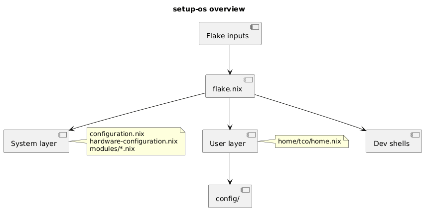
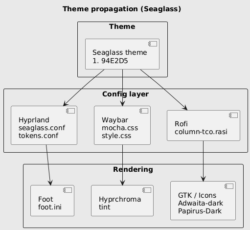
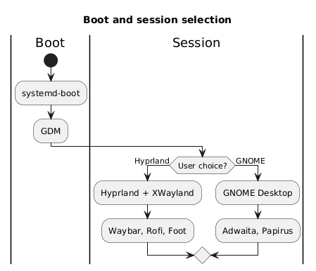
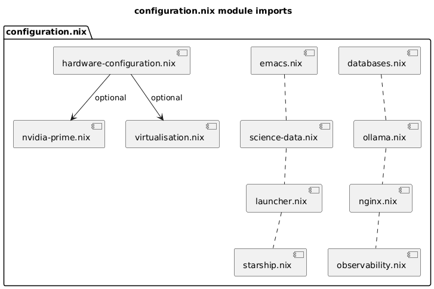
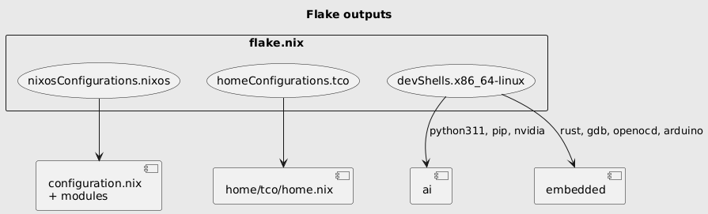

# Documentation annexe

La source de vérité du dépôt est le [README à la racine](../README.md). Ce dossier contient les annexes : rapport cloc en brut, glossaire et diagrammes PlantUML.

---

## Rapport cloc (brut)

Le rapport [cloc](https://github.com/AlDanial/cloc) est enregistré tel quel dans [**cloc-report.md**](./cloc-report.md). Pour le régénérer depuis la racine du dépôt :

```bash
nix shell nixpkgs#cloc -c cloc . --exclude-dir=.git,node_modules,result,.direnv --md --out=docs/cloc-report.md
```

---

## Glossaire

[**specification.txt**](./specification.txt) — Dictionnaire dense de la configuration (options Nix, chemins, variables, commandes, diagrammes).

---

## Diagrammes PlantUML

Sources des diagrammes : `diagrams/*.puml`. Images générées : [`diagrams/png/`](./diagrams/png/). Pour régénérer les PNG depuis la racine :

```bash
nix shell nixpkgs#plantuml -c plantuml -tpng -odocs/diagrams/png docs/diagrams/*.puml
```

---

### Vue d’ensemble du système



Le flake est le point d’entrée : il consomme les inputs (nixpkgs, home-manager, rust-overlay, hyprchroma, nix-snapd) et produit la configuration système (configuration.nix, hardware-configuration.nix, modules), la configuration utilisateur (home/tco/home.nix) et les dev shells (ai, embedded).

---

### Propagation du thème Seaglass



Le thème visuel Seaglass (accent #94E2D5) est décliné dans la couche config (Hyprland, Waybar, Rofi) puis dans le rendu (Foot, Hyprchroma, GTK/icônes Adwaita-dark et Papirus-Dark).

---

### Boot et choix de session



Au démarrage, systemd-boot puis GDM permettent de choisir Hyprland (XWayland, Waybar, Rofi, Foot) ou GNOME (Adwaita, Papirus).

---

### Imports des modules (configuration.nix)



configuration.nix importe hardware-configuration.nix et les modules optionnels (nvidia-prime, virtualisation, emacs, science-data, launcher, starship, databases, ollama, nginx, observability). Les liens optionnels concernent surtout le matériel (nvidia-prime, virtualisation).

---

### Outputs du flake



Le flake expose nixosConfigurations.nixos (configuration complète système), homeConfigurations.tco (Home Manager) et devShells (ai : Python/pip/NVIDIA ; embedded : Rust, gdb, openocd, Arduino, etc.).

---

## Fichiers dans `diagrams/`

| Fichier | Rôle |
| ------- | ---- |
| **system-overview.puml** | Flake → couches System / User / Dev shells |
| **theme-flow.puml** | Propagation du thème Seaglass |
| **boot-session.puml** | Boot → GDM → Hyprland ou GNOME |
| **module-deps.puml** | Imports des modules dans configuration.nix |
| **flake-outputs.puml** | nixosConfigurations, homeConfigurations, devShells |
