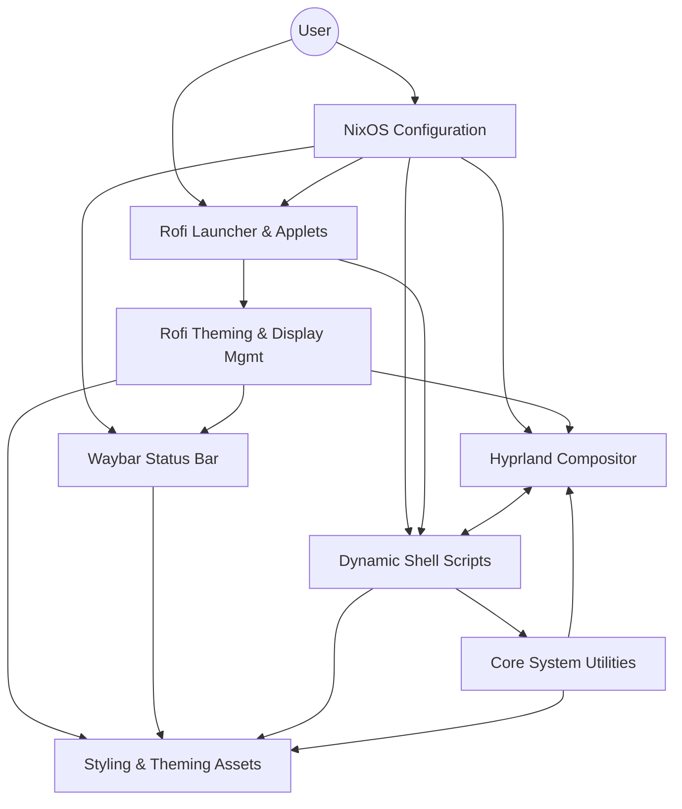
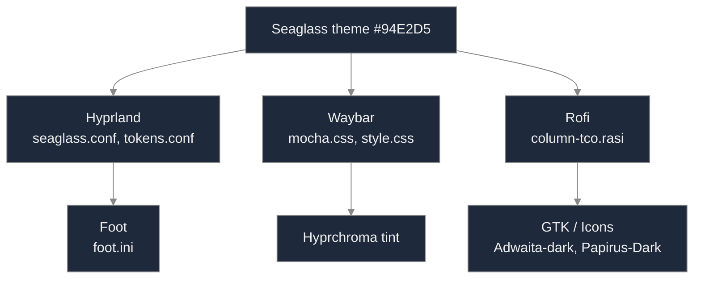
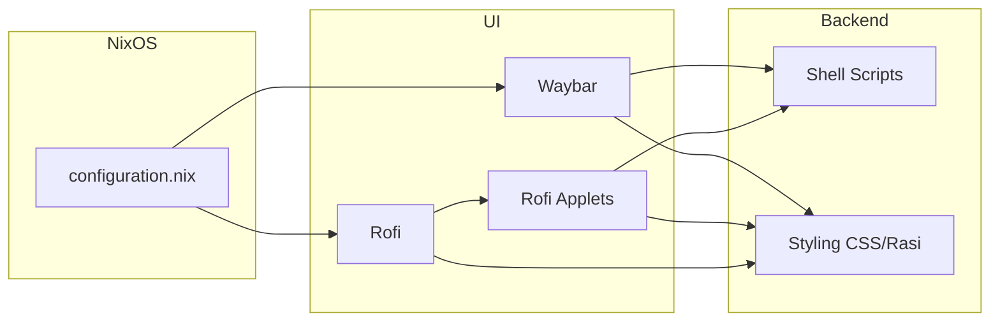
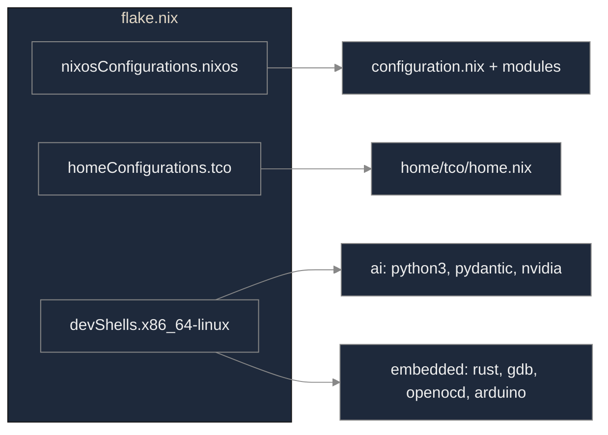

# Technical Deep Dive
Powered by Gemini

This folder contains the technical documentation annexes for the `setup-os` configuration. It focuses on the internal logic, architectural dependencies, and automated workflows that power the user interface.

---

## 1. System Architecture

This diagram illustrates the high-level relationship between the NixOS declarative layer and the dynamic runtime components (scripts, UI, and styling).

[Source: system-architecture.puml](./diagrams/system-architecture.puml) | [Export: system-architecture.png](./diagrams/png/system-architecture.png)

---

## 2. Seaglass Theme Propagation

The Seaglass visual theme (accent #94E2D5) is propagated from the config layer down to the rendering engines and GTK elements, ensuring a unified aesthetic.

[Source: theme-flow.puml](./diagrams/theme-flow.puml) | [Export: theme-flow.png](./diagrams/png/theme-flow.png)

---

## 3. Integration Logic

This visualization shows how `configuration.nix` acts as the orchestrator, integrating various UI components that in turn rely on shared shell scripts and styling assets.

[Source: integration-logic.puml](./diagrams/integration-logic.puml) | [Export: integration-logic.png](./diagrams/png/integration-logic.png)

---

## 4. Execution Flow: Launcher & Grid

```mermaid
sequenceDiagram
  participant L as launcher.sh
  participant C as colors.rasi
  participant R as Rofi
  participant G as rofi-grid.sh
  participant H as Hyprland
  participant W as Waybar

  L->>C: Randomize Accent
  L->>R: Launch Theme
  rect rgb(30, 41, 59)
    R->>G: Launch Grid Context
    G->>H: Blur Adjustment
    G->>W: Kill waybar
  end
  R->>G: Exit Context
  G->>H: Restore Blur
  G->>W: Relaunch waybar
```

This sequence documents the complex coordination required when launching the Rofi grid, including dynamic blur adjustment in Hyprland and process management for Waybar.

[Source: rofi-launcher-flow.puml](./diagrams/rofi-launcher-flow.puml) | [Export: rofi-launcher-flow.png](./diagrams/png/rofi-launcher-flow.png)

---

## 5. Flake Outputs

The flake exposes the full system configuration, user-level Home Manager settings, and specialized development shells for AI and embedded work.

[Source: flake-outputs.puml](./diagrams/flake-outputs.puml) | [Export: flake-outputs.png](./diagrams/png/flake-outputs.png)
