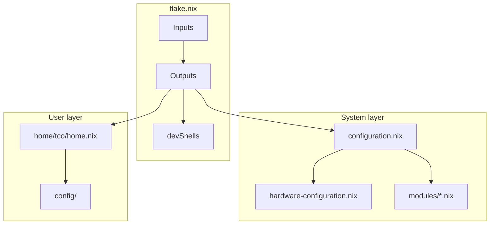
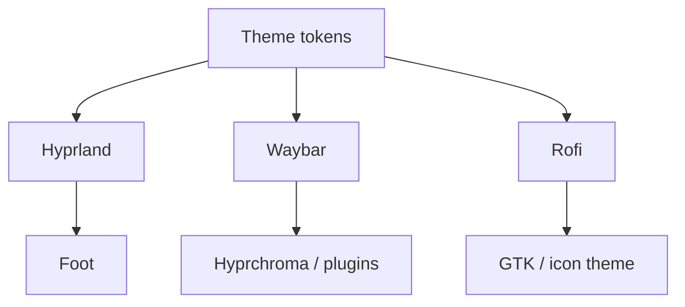

# Architecture

## High-level structure

The repository is split into four main layers:

1. `flake.nix` defines inputs, outputs, and developer shells.
2. `configuration.nix` assembles the system from NixOS modules.
3. `home/tco/home.nix` configures the user environment through Home Manager.
4. `config/` provides UI assets, dotfiles, themes, and helper scripts.

## Component map

## Responsibility split

### `flake.nix`

- pins upstream inputs
- exposes NixOS and Home Manager entry points
- exposes dedicated development shells

### `configuration.nix`

- imports hardware and system modules
- defines boot, networking, desktop, audio, graphics, and global packages
- centralizes host-level behavior

### `modules/`

Each file should implement one isolated concern, for example:

- GPU setup
- virtualization
- databases
- observability
- AI tooling
- shell or prompt enhancements

### `home/tco/home.nix`

- configures user packages
- deploys dotfiles and scripts
- defines GTK and editor preferences
- bridges repository assets into the home directory

### `config/`

- theme files
- Hyprland and Waybar configuration
- terminal and launcher assets
- executable helper scripts

## Theme architecture

The visual stack follows a top-down theme propagation model:

This keeps the theme understandable: a central visual identity fans out into compositor, panel, launcher, terminal, and GTK surfaces.

## Design choices

### Why NixOS + Home Manager

- reproducible system configuration
- explicit dependency graph
- easy rebuild and rollback model
- clearer split between machine scope and user scope

### Why modular files

- lower cognitive load during maintenance
- easier toggling of optional features
- better documentation boundaries

### Why documented diagrams

- Mermaid renders directly on GitHub and is ideal for lightweight repository docs
- PlantUML remains useful for stricter diagrams shared across tools
