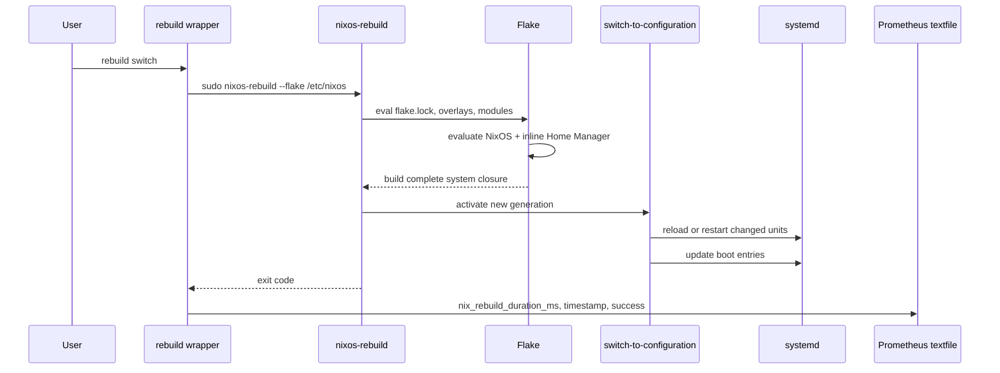

# Architecture & Flake Logic

Cette page documente les décisions structurelles derrière la flake et explique comment la couche système NixOS, la couche utilisateur Home Manager, les modules, les secrets et les dotfiles se composent en une seule activation atomique.


---

## Flake comme source de vérité

La flake est le point d'entrée de tout le système. `flake.nix` exprime l'intention humaine: les entrées externes, le système cible, les overlays, les modules importés et la sortie finale `nixosConfigurations.nixos`. `flake.lock` enregistre les révisions exactes et les hashes résolus pour chaque entrée.

La conséquence est volontaire: aucune mise à jour silencieuse. Le système ne suit pas "la dernière version disponible" au moment du rebuild; il suit exactement ce qui est verrouillé dans `flake.lock`. Une mise à jour passe par `nix flake update`, produit un diff auditable, puis devient active seulement après un `nixos-rebuild switch`.

Les fichiers importants ont des rôles séparés:

| Fichier | Rôle |
| --- | --- |
| `flake.nix` | Déclaration des inputs, overlays et sortie `nixosConfigurations.nixos`. |
| `flake.lock` | Graphe de dépendances résolu, reproductible et versionné. |
| `configuration.nix` | Point d'entrée NixOS: boot, runtime Nix, utilisateurs, desktop, services et imports de modules. |
| `hardware-configuration.nix` | Détection matérielle issue de `nixos-generate-config`, conservée comme code versionné. |
| `home/tco/home.nix` | Couche utilisateur Home Manager: paquets, dotfiles, shell, thèmes, plugins Hyprland. |

---

## Stratégie de résolution des inputs

La flake déclare **10 inputs**. Ces entrées sont organisées par niveau de criticité plutôt que par simple catégorie technique.

| Famille | Inputs | Décision |
| --- | --- | --- |
| Base système | `nixpkgs` | Suit `nixos-unstable` pour les noyaux récents, les pilotes GPU et les toolchains actuelles. |
| Échappatoire stable | `nixpkgs-stable` | Suit `nixos-24.11` pour les paquets qui cassent ou régressent sur unstable. |
| Couche utilisateur | `home-manager` | Suit le même `nixpkgs` que le système via `inputs.nixpkgs.follows`. |
| Tooling | `rust-overlay`, `nix-snapd`, `sops-nix` | Intégrés dans la même évaluation NixOS, sans gestion séparée hors flake. |
| Desktop ABI | `hyprland`, `hyprspace`, `hyprland-plugins`, `hyprtasking` | Hyprland est épinglé en `v0.54.2`; les plugins suivent cette entrée pour éviter les incompatibilités ABI. |

Le choix de `nixos-unstable` est un compromis explicite. Il donne accès aux versions récentes de NixOS, du noyau, des pilotes NVIDIA et de l'environnement Wayland. Le risque de casse est limité par le lockfile: tant que `flake.lock` ne change pas, le système reconstruit la même base.

### Injections stables

Deux paquets sont fournis par `nixpkgs-stable` au moyen d'un overlay local:

- `promtail-bin`: Promtail est lancé comme service systemd brut pour éviter un conflit d'options entre le module Promtail et Loki sur unstable.
- `guix`: Guix est pris depuis `nixos-24.11`, où son environnement de build est plus stable pour cette configuration.

Dans `flake.nix`, `pkgs-stable` est importé avec `allowUnfree = true`, puis exposé dans l'overlay final:

```nix
(final: prev: {
  promtail-bin = pkgs-stable.promtail;
  guix = pkgs-stable.guix;
})
```

Le reste de la configuration consomme donc `pkgs.promtail-bin` et `pkgs.guix` comme des paquets ordinaires, sans devoir connaître leur canal d'origine.

---

## Sortie unique

La flake ne publie qu'une sortie système: `nixosConfigurations.nixos`.

Cette sortie appelle `nixpkgs.lib.nixosSystem` avec:

- `system = "x86_64-linux"` pour fixer l'architecture de build.
- `specialArgs = { inherit inputs; }` pour exposer les inputs à tous les modules NixOS.
- `./configuration.nix` comme racine de la configuration machine.
- les modules NixOS de `nix-snapd`, `sops-nix` et `modules/backup.nix`.
- le module NixOS de Home Manager, configuré inline pour l'utilisateur `tco`.

Cette architecture évite les sorties parallèles du type `homeConfigurations`. Il n'y a pas une commande pour le système et une autre pour l'utilisateur: `sudo nixos-rebuild switch --flake /etc/nixos#nixos` applique les deux couches ensemble.

---

## Composition des overlays

Les overlays sont appliqués avant l'évaluation des modules:

1. `rust-overlay` ajoute les toolchains Rust.
2. `inputs.hyprland.overlays.default` injecte le paquet Hyprland correspondant à l'input épinglé.
3. l'overlay local ajoute `promtail-bin` et `guix` depuis `pkgs-stable`.

L'ordre est important. Les overlays tardifs peuvent voir et remplacer ce qui a été défini avant eux. Ici, l'overlay local est volontairement dernier: il peut corriger un paquet précis sans forcer tout le système à basculer sur le canal stable.

---

## Couche système NixOS

`configuration.nix` est le point d'entrée système. Il contient les décisions globales: bootloader, runtime Nix, utilisateurs, réseau, locale, desktop, audio, portail XDG, paquets système et imports de modules.


Dans `configuration.nix`, les modules système suivants sont importés explicitement:

- `nvidia-prime.nix`: PRIME offload, Intel en GPU primaire, NVIDIA à la demande.
- `virtualisation.nix`: Docker, libvirt/KVM, QEMU et binfmt ARM64.
- `emacs.nix`: daemon Emacs pgtk et outillage LSP.
- `launcher.nix`: intégration desktop, Waybar, Rofi, Nemo, gvfs et udisks2.
- `databases.nix`: PostgreSQL 17 + PostGIS, Redis et Qdrant.
- `ollama.nix`: daemon Ollama avec accélération CUDA.
- `nginx.nix`: reverse proxy local pour services de développement.
- `observability.nix`: Prometheus, Loki, Promtail, Grafana et exports textfile.
- `gdm-wallpaper.nix`: patch déclaratif du fond GDM.

Le module `backup.nix` est actif lui aussi, mais il est injecté au niveau de `flake.nix` avec `sops-nix`, ce qui garde le câblage des secrets et des jobs Restic dans la même liste de modules que l'intégration SOPS.

Les modules `edex.nix`, `lamp.nix` et `streamlit.nix` existent dans `modules/`, mais ne sont pas importés par défaut. Ils restent disponibles comme blocs optionnels.

---

## Couche utilisateur Home Manager

Home Manager est intégré directement dans `nixosConfigurations.nixos`:

```nix
home-manager.useGlobalPkgs = true;
home-manager.useUserPackages = true;
home-manager.extraSpecialArgs = { inherit inputs; };
home-manager.users.tco = import ./home/tco/home.nix;
```

`useGlobalPkgs = true` force Home Manager à utiliser la même instance de `pkgs` que le système. Cela évite une double évaluation de `nixpkgs` et supprime les divergences de versions entre les paquets système et utilisateur.

`home/tco/home.nix` installe les paquets utilisateur, déclare les entrées desktop, configure GTK, Starship, VS Code, Git et Bash, puis relie les dotfiles de `config/` vers `~/.config/`. Les modules `home/tco/modules/apps/` regroupent des toolchains utilisateur par domaine: CAD, data et embarqué.


La couche utilisateur construit aussi plusieurs artefacts:

- `waybarConfig` compile `config/hypr/waybar/style.scss` en `style.css` avec `dart-sass`.
- `hypr-darkwindow` et `hypr-canvas` sont compilés depuis des révisions GitHub fixes.
- `hyprspace` vient de l'input flake `hyprspace`.
- les `.so` résultants sont exposés dans `~/.local/lib/` pour être chargés par `hyprland.conf`.

---

## `specialArgs` et `extraSpecialArgs`

La flake passe `specialArgs = { inherit inputs; }` à `nixosSystem`. Tous les modules NixOS importés peuvent donc recevoir `inputs` comme argument de module, sans plomberie supplémentaire.

Home Manager reçoit le même attrset via `home-manager.extraSpecialArgs`. C'est ce qui permet à `home/tco/home.nix` de référencer directement:

- `inputs.hyprland.packages.${pkgs.system}.hyprland`
- `inputs.hyprspace.packages.${pkgs.system}.Hyprspace`

Cette décision garde les modules autonomes: un module peut utiliser une entrée flake explicite sans que `configuration.nix` doive lui passer un argument dédié ou créer un overlay intermédiaire.

---

## Build flow et activation

Le script utilisateur `rebuild`, exposé dans `~/.local/bin/rebuild`, est un wrapper autour de `nixos-rebuild`. Il reconstruit `/etc/nixos#nixos`, mesure la durée, enregistre le succès ou l'échec, puis écrit les métriques dans le textfile collector de Node Exporter.



L'activation est atomique au niveau pratique: si la couche système ne construit pas, Home Manager ne s'active pas; si Home Manager échoue, le système ne bascule pas. Il n'y a pas d'état intermédiaire volontaire où NixOS serait en génération N+1 pendant que l'environnement utilisateur resterait en génération N.

---

## Boot, rollback et garbage collection

Le bootloader utilise systemd-boot avec `configurationLimit = 1`. Le menu garde une seule entrée NixOS, ce qui limite l'accumulation d'entrées de boot, mais retire le rollback confortable depuis le menu systemd-boot.

Le rollback passe donc par l'un de ces chemins:

- `sudo nixos-rebuild switch --rollback` si une génération précédente existe encore dans les profils Nix.
- restauration de l'ancien `flake.lock`, puis rebuild.
- intervention depuis un shell de secours ou live session si la génération active ne démarre plus.

La GC automatique est hebdomadaire avec `--delete-older-than 7d`. Elle peut supprimer d'anciennes générations et chemins du store, mais elle ne supprime jamais ce qui est encore référencé par le profil système courant.

Le boot est aussi configuré pour le dual-boot Windows: une entrée `windows.conf` est injectée pour Windows 11, et `loader.conf` est patché après installation pour forcer l'affichage du menu avec `timeout menu-force`.

---

## Configuration matérielle

`hardware-configuration.nix` est le résultat de `nixos-generate-config`. Le fichier est conservé dans le dépôt et traité comme du code: il n'est pas régénéré automatiquement à chaque rebuild.

Il encode les hypothèses matérielles suivantes:

- plateforme `x86_64-linux`;
- microcode Intel activé via `hardware.cpu.intel.updateMicrocode`;
- root et `/home` en EXT4 sur partitions identifiées par UUID;
- partition EFI `/boot` en VFAT avec masques restrictifs;
- swap déclaré par UUID;
- modules initrd pour USB, Thunderbolt, NVMe et HID.

La configuration GPU n'est volontairement pas dans ce fichier. Elle vit dans `modules/nvidia-prime.nix`, parce qu'elle relève d'une décision d'architecture desktop, pas seulement de la détection matérielle brute.

Note importante: le fichier actuel déclare une partition swap classique par UUID. Il ne configure pas de swap chiffré avec clé aléatoire au boot.

---

## Hygiène du store Nix

Deux réglages gardent le store local sain dans le temps.

`auto-optimise-store = true` déduplique les fichiers identiques du store avec des hard links. Ce travail est transparent et évite que plusieurs générations conservent inutilement les mêmes contenus physiques.

Le sandbox Nix est actif avec:

```nix
sandbox = true;
sandbox-build-dir = "/build";
```

`/build` est un bind mount vers `/home/nix-build`. Les artefacts de build volumineux restent donc hors de la partition racine, tout en conservant l'isolation du sandbox Nix pendant les builds.

---

## Politique des diagrammes

Les pages wiki ne doivent pas pointer vers des chemins locaux du type `file:///etc/nixos/...`: ces liens ne fonctionnent que sur cette machine et ne s'affichent pas depuis GitHub.

La documentation actuelle utilise des sources PlantUML dans `docs/diagrams/*.puml` et des rendus PNG pré-générés dans `docs/assets/diagrams/`. Les pages wiki référencent les PNG via `raw.githubusercontent.com`, ce qui les rend lisibles aussi bien localement que sur le wiki GitHub.

D2 est disponible sur le poste et peut servir pour de nouveaux schémas, mais la base documentaire existante reste PlantUML pour éviter deux pipelines de génération concurrents.

---

## Arborescence du dépôt

Vue de haut niveau équivalente au `tree` réel du dépôt, découpée par grandes zones de responsabilité.

Les captures suivantes sont générées par `docs/scripts/render-code-map.mjs`: le script construit des vues HTML/SVG façon TreeView de design system, inspirées du modèle Carbon (branches, feuilles, carets, panneau de propriétés), puis Chrome headless en produit des screenshots PNG. Ce ne sont ni Mermaid ni PlantUML; ce sont des images de visualiseur basées sur la structure réelle du dépôt.


La racine contient le contrat de build: la flake, son lockfile, la configuration système principale et la détection matérielle.

```text
/etc/nixos/
├── flake.nix                  # Inputs, overlays, nixosConfigurations.nixos
├── flake.lock                 # Révisions et hashes résolus
├── configuration.nix          # Racine NixOS: boot, runtime, desktop, services, imports
├── hardware-configuration.nix # Détection matérielle versionnée
├── README.md
└── LICENSE
```

`flake.nix` décide ce qui compose une machine complète. `configuration.nix` décrit la machine NixOS elle-même. `hardware-configuration.nix` reste volontairement séparé: il documente le matériel détecté, sans mélanger les choix de desktop, de services ou de sécurité.

Les modules système vivent ensuite dans `modules/`. Chaque fichier correspond à une capacité cohérente, activée en l'important depuis `configuration.nix` ou, pour le backup, depuis `flake.nix` avec `sops-nix`.


```text
/etc/nixos/modules/
├── backup.nix          # Restic + Backblaze B2 + sops-nix
├── databases.nix       # PostgreSQL, Redis, Qdrant
├── emacs.nix           # Emacs pgtk daemon et LSP tooling
├── gdm-wallpaper.nix   # Patch déclaratif du thème GDM
├── launcher.nix        # gvfs, udisks2, Rofi, Waybar, Nemo
├── nginx.nix           # Reverse proxy localhost
├── nvidia-prime.nix    # PRIME offload Intel/NVIDIA
├── observability.nix   # Prometheus, Loki, Promtail, Grafana
├── ollama.nix          # Ollama CUDA daemon
├── virtualisation.nix  # Docker, libvirt/KVM, QEMU, ARM64 binfmt
├── edex.nix            # Optionnel: environnement FHS eDEX-UI
├── lamp.nix            # Optionnel: Apache/PHP/MariaDB
└── streamlit.nix       # Optionnel: service Streamlit
```

Cette zone est strictement système. Elle touche aux services, aux daemons, aux drivers, au boot, aux bases locales et aux intégrations qui doivent exister avant ou indépendamment de la session utilisateur.

La couche Home Manager est plus petite en arborescence, mais elle porte beaucoup de comportement utilisateur: paquets, shell, thèmes, éditeurs, symlinks de dotfiles et plugins Hyprland.


```text
/etc/nixos/home/tco/
├── home.nix            # Home Manager: paquets, dotfiles, thèmes, shell
└── modules/
    └── apps/           # Modules HM: cad, data, embedded
```

`home.nix` est évalué dans le même rebuild que NixOS. Les modules `apps/` servent à regrouper les outils par domaine de travail: CAD, data et embarqué. Ils restent utilisateur-only: pas de service systemd global, pas de driver, pas d'état machine.

Les dotfiles et scripts sont stockés dans `config/`, puis reliés dans `$HOME` par Home Manager. C'est la partie "surface utilisateur" du dépôt.


```text
/etc/nixos/config/
├── bin/          # Scripts utilisateur sur le PATH
├── conky/        # Overlays et scripts de monitoring desktop
├── doom/         # Configuration Doom Emacs
├── fastfetch/    # Layout fastfetch
├── foot/         # Terminal Foot
├── grafana/      # Dashboards provisionnés
├── hypr/         # Hyprland, Hypridle, Hyprlock, Waybar, thèmes
├── nvim/         # Configuration Neovim
├── rofi/         # Thèmes et launchers Rofi
├── scss/         # Variables et mixins partagés
├── swappy/       # Outil d'annotation screenshot
└── wal/          # Templates PyWal
```

Cette séparation évite de mettre les fichiers de configuration applicative directement dans `home.nix`. Le Nix décrit comment les fichiers sont exposés; `config/` contient leur contenu réel. C'est particulièrement utile pour Hyprland, Waybar, Rofi, Neovim et les scripts de `bin/`, qui restent lisibles et modifiables comme des fichiers normaux.

La documentation explique le système et contient les assets publiés: captures, logos, diagrammes rendus, sources PlantUML, pages wiki et scripts de génération.


```text
/etc/nixos/docs/
├── README.md          # Deep dive technique
├── cloc-report.md     # Rapport de taille du code
├── specification.txt  # Spécification structurée
├── assets/            # Captures, logos, diagrammes rendus, fond GDM
├── diagrams/          # Sources PlantUML
└── wiki/              # Pages publiées dans le wiki GitHub
```

`docs/` n'est pas importé comme logique Nix, sauf exception assumée: `docs/assets/gdm-background.png` est référencé par `configuration.nix` pour le fond GDM. Les captures TreeView générées par `render-code-map.mjs` vivent aussi dans `docs/assets/`.

Les secrets forment une zone séparée et volontairement minimale. Le dépôt peut les contenir parce que les valeurs sensibles sont chiffrées avec SOPS/Age avant d'entrer dans Git.


```text
/etc/nixos/secrets/
├── backup.yaml        # Secrets SOPS chiffrés
└── README.md          # Notes de gestion des secrets
```

`secrets/backup.yaml` est lisible dans Git uniquement sous forme chiffrée. Le contenu utile est rendu à l'activation par `sops-nix`, puis injecté dans les services qui en ont besoin.

La séparation de responsabilités finale est donc:

- `modules/` contient le comportement système.
- `home/tco/` contient le comportement utilisateur.
- `config/` contient les dotfiles et scripts exposés dans `$HOME`.
- `secrets/` contient uniquement des secrets chiffrés.
- `docs/` contient la documentation et les assets. Exception assumée: `docs/assets/gdm-background.png` est référencé par `configuration.nix` pour le fond GDM.

Cette structure permet de lire chaque sous-arbre indépendamment sans devoir comprendre tout le système d'un seul bloc.
