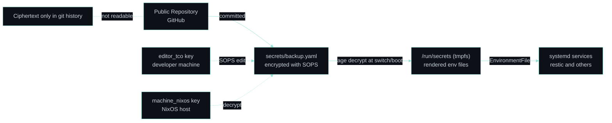

This page covers the threat model, the cryptographic design, and the operational lifecycle of secrets in this NixOS configuration.

---

## Threat Model

The repository is public. Any file committed in plaintext is permanently visible in git history — including all past states of the file, even after it is deleted or overwritten. The secrets management strategy must satisfy two constraints simultaneously: secrets must be in the repository, because they are part of the system state and keeping them out-of-band defeats the reproducibility guarantee; and secrets must never be readable from the repository, because API keys, backup passwords, and credentials must not be reconstructable by anyone who clones it.

The solution is to encrypt secrets before committing and decrypt them at runtime using an identity that never enters the repository.

---

## Secrets Flow



---

## Cryptographic Stack

The approach uses two tools in combination. SOPS (Secrets OPerationS) is a structured secret editor that encrypts the values of a YAML file while leaving the keys in plaintext. The actual [`secrets/backup.yaml`](https://github.com/RomeoCavazza/setup-os/blob/main/secrets/backup.yaml) in this repo looks like this once committed:

```yaml
restic_password: ENC[AES256_GCM,data:zcUjTsN4AKk=,iv:XsmQm...,type:str]
b2_key_id:       ENC[AES256_GCM,data:Y5YOcIntah1B...,type:str]
b2_app_key:      ENC[AES256_GCM,data:jLPBoTfAX0nh...,type:str]
```

The field names — `restic_password`, `b2_key_id`, `b2_app_key` — are visible and auditable. Their values are ciphertext. This property is intentional: it allows the structure of what secrets exist to be reviewed without exposing the content.

Age is the underlying asymmetric encryption primitive, using X25519 key exchange and ChaCha20-Poly1305 for authenticated encryption. SOPS uses Age to encrypt the symmetric data encryption key, so decryption requires the corresponding Age private key.

---

## Key Configuration

The [`.sops.yaml`](https://github.com/RomeoCavazza/setup-os/blob/main/.sops.yaml) at the repo root registers two Age recipients:

```yaml
keys:
  - &editor_tco   age1z3hs5u2u7m2nnnz92e6k3yt6txj5emejatgd2gd2l5lpekw3xvqqkd5arz
  - &machine_nixos age1fy3myqdnhww42tamc323qlmp2zuhh67qmvga3ncv44jdputw0vpqw80twd

creation_rules:
  - path_regex: secrets/.*\.yaml$
    key_groups:
      - age:
          - *editor_tco
          - *machine_nixos
```

`editor_tco` is the developer's personal key, stored on the development machine and used to edit secrets. `machine_nixos` is the machine's own key, stored at `/var/lib/sops-nix/key.txt` on the NixOS host. SOPS encrypts each secret to both recipients simultaneously — the machine does not need the editor key to boot, and the developer does not need access to the machine key to update secrets.

See [`modules/backup.nix`](https://github.com/RomeoCavazza/setup-os/blob/main/modules/backup.nix) for how these keys are consumed at the system level.

---

## NixOS Integration

[`backup.nix`](https://github.com/RomeoCavazza/setup-os/blob/main/modules/backup.nix) declares how secrets are consumed at the system level:

```nix
sops.defaultSopsFile = ../secrets/backup.yaml;
sops.age.keyFile     = "/var/lib/sops-nix/key.txt";
sops.age.sshKeyPaths = [];

sops.secrets.restic_password = {};
sops.secrets.b2_key_id       = {};
sops.secrets.b2_app_key      = {};

sops.templates."restic-b2.env" = {
  mode = "0400";
  content = ''
    AWS_ACCESS_KEY_ID=${config.sops.placeholder.b2_key_id}
    AWS_SECRET_ACCESS_KEY=${config.sops.placeholder.b2_app_key}
  '';
};
```

During `nixos-rebuild switch`, sops-nix reads the machine Age key, decrypts [`backup.yaml`](https://github.com/RomeoCavazza/setup-os/blob/main/secrets/backup.yaml) in memory, and writes the result to `/run/secrets/` — a tmpfs (RAM only, not persisted to disk, cleared on reboot). The rendered `restic-b2.env` lands at `/run/secrets/rendered/restic-b2.env` and is injected into the restic service via `EnvironmentFile`. Restic never sees the credentials as CLI arguments, which would expose them in `ps` output and the systemd journal.

---

## Key Lifecycle

**Editing a secret:**
```bash
sops secrets/backup.yaml
```
This decrypts the file using the editor Age key, opens it in `$EDITOR`, and re-encrypts on save. The decrypted content never touches the repository.

**Verifying decryption on the host:**
```bash
sudo cat /run/secrets/restic-b2.env
```

**Adding a new machine recipient:**
```bash
# 1. Generate an Age key on the new host
sudo ssh-keygen -t ed25519 -f /var/lib/sops-nix/key.txt   # or: age-keygen

# 2. Add its public key to .sops.yaml under keys and creation_rules

# 3. Re-encrypt all secrets for the new recipient
sops updatekeys secrets/backup.yaml
```

---

## Backup Jobs

Two independent systemd timer and service pairs handle backups. The first, `b2-critical`, runs nightly at 02:00 and targets the highest-priority material:

```
/etc/nixos          → NixOS configuration
~/.ssh              → SSH keys
~/.gnupg            → GPG keychain
~/.config           → all user app configs (minus browser caches)
```

Retention: 14 daily, 8 weekly, 6 monthly snapshots.

The second, `b2-data`, runs at 03:00 and targets user data — Desktop, Documents, Images — with shorter retention (7 daily, 4 weekly, 3 monthly) and explicit excludes for rebuildable directories (`node_modules`, `target`, `.venv`, `.direnv`).

Both timers use a random delay (20 and 30 minutes respectively) to avoid simultaneous upload bursts. Both use the same B2 S3-compatible endpoint:

```
s3:s3.eu-central-003.backblazeb2.com/tco-nixos-backup/restic
```

**Triggering a backup manually:**
```bash
sudo systemctl start restic-backups-b2-critical.service
sudo systemctl start restic-backups-b2-data.service
```

**Checking backup integrity:**
```bash
sudo restic -r s3:s3.eu-central-003.backblazeb2.com/tco-nixos-backup/restic check
sudo restic -r s3:s3.eu-central-003.backblazeb2.com/tco-nixos-backup/restic check --read-data-subset=10%
```

---

## Security Properties

Every secret in this repository is encrypted before it is committed and decrypted only in RAM at activation time. Private keys never enter the repository — only public keys appear, in [`.sops.yaml`](https://github.com/RomeoCavazza/setup-os/blob/main/.sops.yaml). Backup data is encrypted client-side by restic (AES-256) before leaving the machine, so Backblaze B2 has no access to the content. Revoking a compromised key means removing it from [`.sops.yaml`](https://github.com/RomeoCavazza/setup-os/blob/main/.sops.yaml) and running `sops updatekeys secrets/backup.yaml` — the old key can no longer decrypt after the next commit.